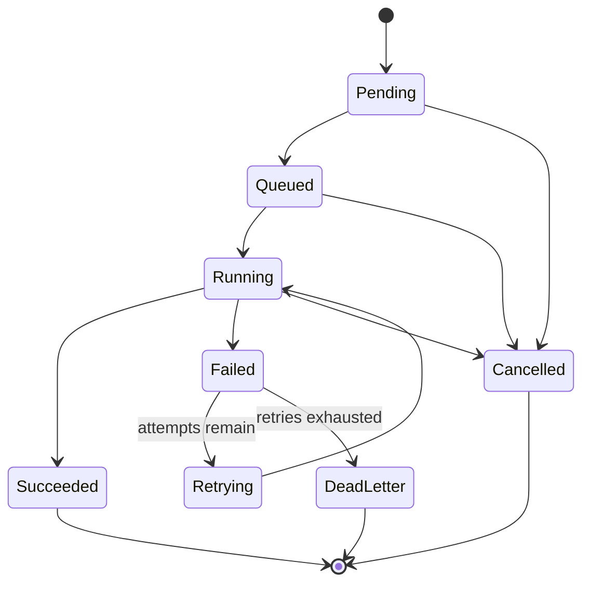

# FlowForge Execution Model (Phase 2B-1 / Phase 2B-2 / Phase 2B-3 / Phase 2B-4 / Phase 2B-5)

This document describes the job execution model: the job lifecycle, the handler abstraction, the
`HandlerRegistry` (Phase 2B-1), the `PriorityScheduler` (Phase 2B-2), the `LocalWorkerPool` +
`JobExecutor` (Phase 2B-3) -- the first phase where FlowForge actually executes a job -- the
`RetryDispatcher` (Phase 2B-4, §18) -- the first phase where a failed job is actually retried
rather than merely modeled as retryable -- and the observability/reliability layer built on top of
all of it (Phase 2B-5, §20). It complements [`overview.md`](overview.md) rather than replacing
it — see that document for the component/dependency-direction picture of the whole system.

**Scope of Phase 2B-1.** Built the seam a future Executor will run jobs through: a handler
interface, an execution context, an execution result type, and a thread-safe registry mapping job
type to handler, plus three real built-in handlers (`echo`, `delay`, `transform`) that prove the
abstraction end-to-end. It deliberately did **not** build the Scheduler, Executor, WorkerPool,
retry engine, timeout engine, workflow DAG execution, distributed coordination, or worker
registration.

**Scope of Phase 2B-2.** Implemented `IScheduler` for real: a bounded, priority-ordered,
in-memory dispatch queue (`PriorityScheduler`, §7) that validates a job, resolves its handler via
`HandlerRegistry`, and dispatches it -- stopping short of *executing* that handler. Also threaded
`job_type` through the create-job API and persistence for the first time (§4) and wired the
Scheduler into `apps/server` (§8) so `POST /api/v1/jobs` can submit a job for real, end-to-end,
locally verified dispatch. Still did **not** build the Executor, WorkerPool, retry engine, timeout
enforcement, or workflow DAG execution.

**Scope of Phase 2B-3 (this phase).** Implements `IWorkerPool` (`LocalWorkerPool`, §10) and
`IExecutor` (`JobExecutor`, §11) for real, completing the path
`PriorityScheduler -> WorkerPool -> Executor -> HandlerRegistry -> IJobHandler -> ExecutionResult`.
A job with a registered `job_type` genuinely transitions `Queued -> Running ->
Succeeded`/`Failed`/`Cancelled`, with a real `job_attempts` row persisted per attempt (§12) via a
new `engine::IExecutionManager` implementation (§13). Adds cooperative cancellation reaching a
*running* handler (§14) and a cooperative execution timeout (§15) -- neither ever forcibly
terminates a thread. Still does **not** build a retry engine (a `Failed` job is never
automatically rescheduled), workflow DAG execution, or distributed/multi-process worker
coordination.

**Scope of Phase 2B-4 (this phase).** Implements the retry engine: `JobExecutor` now consults
`domain::ExecutionResult::retryable()` (an existing Phase 2B-1 hint nothing previously consumed)
to decide whether a failed attempt lands on `Retrying`/`DeadLetter` (via the existing
`Job::record_attempt_failure()`, likewise previously never called) or straight on `Failed` (via
`Job::record_execution_failure()`, unchanged), and a new `engine::RetryDispatcher` (§18)
re-submits a `Retrying` job back through the same `IScheduler` a fresh job goes through, once its
`RetryPolicy::compute_backoff()` delay has elapsed. Still does **not** build workflow DAG
execution, distributed/multi-process worker coordination, or a `retry_policy` schema change (see
§18.6 for what that would require).

## 1. Job lifecycle

`domain::JobStatus` (`engine/include/flowforge/domain/job.hpp`) already modeled the full lifecycle
in Phase 1/2A; this phase did not change it (see §10 of the phase brief — "if the existing model
already correctly enforces these invariants, preserve it"):



`Job::transition_to()` and `Job::record_attempt_failure()`/`record_attempt_success()`
(`engine/src/domain/job.cpp`) are the only ways to move a `Job` between states, and
`domain::is_terminal()` identifies `Succeeded`/`Cancelled`/`DeadLetter` as terminal —
`JobService::cancel_job()` already relies on this to reject cancelling a terminal job with
`ErrorCode::Conflict`. Phase 2B-3 made `Queued -> Running -> Succeeded`/`Failed`/`Cancelled` real
(§11). Phase 2B-4 makes `Retrying -> Running` real too (§18): `JobExecutor` now calls
`record_attempt_failure()` (landing on `Retrying`/`DeadLetter` per `RetryPolicy`) instead of always
`record_execution_failure()` (straight to `Failed`) whenever the handler declared its failure
`retryable()`; a non-retryable failure still goes straight to `Failed`, exactly as in Phase 2B-3.
`RetryPolicy::compute_backoff()` is no longer an untriggered pure function -- `RetryDispatcher`
calls it on every poll tick to decide whether a `Retrying` job's backoff has elapsed.

## 2. Execution boundary

```mermaid
flowchart TB
    HTTP["POST /api/v1/jobs<br/>(real)"]
    JobService["services::JobService<br/>(real — create/get/list/cancel/mark_queued)"]
    PG[("PostgreSQL")]
    Scheduler["engine::PriorityScheduler<br/>(real — implements IScheduler)"]
    Queue["PriorityBlockingQueue<br/>(real, bounded, priority+FIFO)"]
    WorkerPool["engine::LocalWorkerPool<br/>(real — implements IWorkerPool)"]
    Executor["engine::JobExecutor<br/>(real — implements IExecutor)"]
    Registry["engine::HandlerRegistry<br/>(real)"]
    Handler["engine::IJobHandler<br/>(real interface)"]
    Builtin["handlers::Echo/Delay/TransformHandler<br/>(real implementations)"]
    Result["domain::ExecutionResult<br/>(real)"]
    Execution["domain::Execution / job_attempts<br/>(real — via IExecutionManager)"]

    HTTP --> JobService
    JobService --> PG
    HTTP -->|if job_type set| Scheduler
    Scheduler -->|validate + resolve handler| Registry
    Scheduler --> Queue
    Queue -->|dispatch loop: pop, dispatch()| WorkerPool
    HTTP -.->|on schedule success| JobService
    WorkerPool -->|worker thread: execute()| Executor
    Executor -->|Queued -> Running -> Succeeded/Failed/Cancelled| PG
    Executor -->|resolve| Registry
    Registry --> Handler
    Handler --> Builtin
    Handler --> Result
    Executor -->|maps ExecutionResult -> Execution, records| Execution
    Execution --> PG
```

`engine::IExecutor` (`engine/include/flowforge/engine/executor.hpp`) is the interface seam from
Phase 1; Phase 2B-1 added everything from `HandlerRegistry` down to `ExecutionResult`, Phase 2B-2
added the real `PriorityScheduler`, and Phase 2B-3 (this phase) adds the real `LocalWorkerPool`
and `JobExecutor` that complete the path: a job is dequeued in priority order, handed to a real
worker, actually executed through `IJobHandler::execute()`, and the resulting
`domain::ExecutionResult` is mapped into a persisted `domain::Execution` (`job_attempts` row, §12)
and a real `Job` status transition (`Queued -> Running -> Succeeded`/`Failed`/`Cancelled`, §11).
See §10–§17 for the full design.

## 3. The handler abstraction

### 3.1 `IJobHandler` (`engine/include/flowforge/engine/job_handler.hpp`)

```cpp
class IJobHandler {
 public:
  virtual std::string_view job_type() const noexcept = 0;
  virtual Result<domain::ExecutionResult> execute(const ExecutionContext& context,
                                                   const std::string& payload) = 0;
};
```

- `job_type()` is the stable key `HandlerRegistry` registers/resolves by (e.g. `"echo"`).
- `execute()`'s `Result`'s error channel is reserved for "could not meaningfully attempt this at
  all" (a payload that fails a hard structural/bounds check before any work starts — see
  `DelayHandler`'s duration-bounds check). "The job ran and did not succeed," including
  cooperative cancellation partway through, is reported as `domain::ExecutionResult::failure(...)`,
  a value, not an error — this mirrors how `JobService` already treats "caller input rejected"
  (a `Result` error) as distinct from "operation reached a terminal, unsuccessful state" (a
  `JobStatus` value).
- Handlers never receive a database connection, an HTTP request/response, or the dashboard —
  only an opaque payload and an `ExecutionContext` (§3.2). This is what keeps a handler
  unit-testable in complete isolation (see `engine/tests/handlers/`).

### 3.2 `ExecutionContext` (`engine/include/flowforge/engine/execution_context.hpp`)

Everything a handler is allowed to see about the outside world: `job_id`, `attempt_id`,
`worker_id`, a `Logger&`, an optional `MetricsRegistry*`, and a cooperative cancellation flag
(`is_cancelled()`/`request_cancellation()`, backed by a shared `atomic<bool>` so the component
that invoked a handler can request cancellation of a handler already running on another thread).
`attempt_id`/`worker_id` are forward-looking: nothing persists a `job_attempts` row or runs
handlers on a real worker pool yet, but the shape is ready for the future Executor to populate
them without another `IJobHandler` signature change.

### 3.3 `ExecutionResult` (`engine/include/flowforge/domain/execution_result.hpp`)

Distinct from `domain::Execution` (`execution.hpp`), which is the *persisted* `job_attempts` row
a future Executor will write. `ExecutionResult` is the handler layer's own in-memory return value:
a `success(output, duration, metadata)` or `failure(error_code, error_message, retryable,
duration, metadata)`, built only through those two named factories so a result can never combine
`retryable() == true` with `status() == Succeeded`. `output` is an opaque string (like
`Job::payload()`) — the domain layer has no JSON dependency (see `overview.md` §2), so a handler
returning structured output serializes it itself. `retryable` is a hint for the future
retry engine (a handler is best-placed to know whether its own failure is transient); nothing
consumes the hint yet.

### 3.4 `HandlerRegistry` (`engine/include/flowforge/engine/handler_registry.hpp`)

An explicit, constructed-and-injected `unordered_map<string, shared_ptr<IJobHandler>>` — not a
singleton or global. `register_handler()` fails with `ErrorCode::Validation` for a null handler
or empty `job_type()`, and `ErrorCode::Conflict` for a duplicate registration (never a silent
overwrite). `resolve()` fails with `ErrorCode::NotFound` for an unregistered type — an expected,
operational outcome, not an exception (per the phase brief, "do not throw exceptions for normal
operational conditions").

**Thread-safety.** A `std::shared_mutex` splits registration (unique/writer lock) from
`resolve()`/`contains()` (shared/reader lock): once handlers are registered at startup, many
worker threads can call `resolve()` concurrently with no contention against each other, and
`resolve()` while a registration is in flight is still safe (just serialized against that one
write). `engine/tests/engine/handler_registry_test.cpp` includes tests that hammer `resolve()`
from 16 threads concurrently, execute the same stateless handler instance concurrently from 16
threads, and register a new handler while another thread is continuously resolving — all under
`-fsanitize=address,undefined` in CI's sanitizer job.

**Ownership/lifetime.** `HandlerRegistry` owns `shared_ptr<IJobHandler>`s; `resolve()` hands out a
copy of that `shared_ptr`, so a caller holding a resolved handler keeps it alive even if
`register_handler()` is (hypothetically) later extended to support unregistration. The registry
itself is owned and constructed by the composition root (`apps/server/src/http/app.cpp::App::create()`,
as of Phase 2B-2) and injected into whatever needs it (`PriorityScheduler` today; the future
Executor too) — never a `static`/global instance.

### 3.5 Built-in handlers (`engine/include/flowforge/handlers/`, `engine/src/handlers/`)

| Handler | `job_type()` | Behavior | Bounds |
|---|---|---|---|
| `EchoHandler` | `echo` | Returns the payload unchanged. | Payload ≤ 256 KiB. |
| `TransformHandler` | `transform` | Uppercases the payload (`"hello world"` → `"HELLO WORLD"`). | Payload ≤ 256 KiB. |
| `DelayHandler` | `delay` | Sleeps for a payload-specified number of milliseconds, then succeeds. | Payload must be a non-negative integer ≤ `DelayHandler::kMaxDelay` (30s); polls `ExecutionContext::is_cancelled()` every 20ms so cooperative cancellation takes effect within one poll interval instead of only after the full delay elapses. |

All three are stateless (no data members mutated after construction), so a single instance —
exactly what `HandlerRegistry` hands out — is safe to call concurrently from many threads.
`handlers::register_builtin_handlers(HandlerRegistry&)` registers all three explicitly; it is
**not** a static/global initializer, so registration order and failure are observable and
testable rather than happening silently before `main()`.

## 4. `Job::job_type()` — now fully plumbed (Phase 2B-2)

`domain::Job` gained a `job_type` field (default `""`) and accessor in Phase 2B-1, because
`HandlerRegistry`/`IJobHandler` need *some* job-carried key distinct from `queue_name`
(`queue_name` is about routing/capacity — which logical queue a job waits on; `job_type` is about
*what code runs*). Phase 2B-1 deliberately left it unpersisted, since nothing yet read it back off
a stored job. Phase 2B-2 adds the reader (`PriorityScheduler`), so `job_type` is now threaded all
the way through:

- `services::JobService::CreateJobRequest::job_type` (optional, default `""`) —
  `JobService::create_job` only validates its length (`<= 128` chars, mirroring `queue_name`'s
  bound); it deliberately does **not** check that a handler is registered for it, which would
  couple `JobService` to `HandlerRegistry` (a Scheduler concern, not a persistence-layer one).
- The HTTP create-job API: `POST /api/v1/jobs` accepts an optional `"job_type"` string field (see
  §8) and returns it in every job JSON representation.
- Persistence: migration `0011_add_job_type_to_jobs.sql` adds `jobs.job_type TEXT NOT NULL DEFAULT
  ''` (existing rows get `''`, matching `domain::Job`'s in-memory default exactly — no backfill
  needed); `PostgresJobRepository` reads/writes it in `insert`/`find_by_id`/`list`/`update`.
  `InMemoryJobRepository` needed no change — it already stores whole `domain::Job` value objects.

## 5. Security

- Handlers never execute arbitrary shell commands or user-supplied code, never see a database
  connection or credentials, never see an HTTP request/response, and never see arbitrary
  filesystem paths — `ExecutionContext` is the entire surface a handler has access to.
- Payload is untrusted input at the handler level, independent of whatever validation happened
  upstream (e.g. `JobService::create_job`'s payload-size check) — each built-in handler enforces
  its own bound rather than assuming a caller already did (defense in depth; see
  `EchoHandler`/`TransformHandler`'s 256 KiB cap and `DelayHandler`'s 30s cap).
- `DelayHandler::kMaxDelay` specifically exists so a malicious or buggy payload cannot tie up a
  worker thread indefinitely once a real worker pool exists.
- `HandlerRegistry` only ever exposes handlers explicitly registered through
  `register_handler()` — there is no dynamic/reflective dispatch by job-type string to arbitrary
  code.

## 6. What's real vs. deferred (Phase 2B-1)

| Area | Status |
|---|---|
| `IJobHandler`, `ExecutionContext`, `domain::ExecutionResult` | **Real.** Unit tested. |
| `HandlerRegistry` | **Real, thread-safe, tested** (registration, resolution, concurrent lookup, concurrent execution). |
| `EchoHandler`, `TransformHandler`, `DelayHandler` | **Real, executable, tested** — including `DelayHandler`'s cooperative-cancellation path. |

## 7. `PriorityScheduler` (Phase 2B-2)

### 7.1 Responsibility

`engine::PriorityScheduler` (`engine/include/flowforge/engine/priority_scheduler.hpp`,
`engine/src/engine/priority_scheduler.cpp`) is the first real `IScheduler` implementation. It:

- accepts jobs for scheduling (`schedule()`), validating and resolving the handler synchronously
  so a caller gets an immediate, actionable answer;
- maintains an internal, bounded, priority-ordered dispatch queue (`PriorityBlockingQueue`, §7.2);
- exposes queue depth (`queue_depth()`) and lifecycle state (`state()`);
- starts/stops cleanly (`start()`/`stop()`, §7.4);
- dispatches queued work toward the future Executor boundary (`dispatch_loop()`, §7.3) by
  resolving each job's handler via `HandlerRegistry` a second time (proving the live dispatch
  path, not just the admission-time check) and then stopping -- it never calls
  `IJobHandler::execute()`.

It is **not** responsible for, and has no dependency on: HTTP (`apps/server` calls `schedule()`),
PostgreSQL (never touches an `IJobRepository` -- see §7.5), concrete handler implementations (only
ever goes through `HandlerRegistry`/`IJobHandler`), worker process management (`IWorkerPool` is a
distinct future component), retry policy execution, or executing any handler.

### 7.2 Priority queue and ordering

`engine::PriorityBlockingQueue<T, Compare>` (`engine/include/flowforge/engine/
priority_blocking_queue.hpp`) is a sibling of the existing `BlockingQueue<T>`: same
mutex/condition-variable/`close()` shutdown pattern, backed by `std::priority_queue` instead of a
FIFO `std::deque`. Unlike `BlockingQueue`, it has no unbounded mode and no blocking push --
`try_push()` is the only way in and never blocks, which is what lets `PriorityScheduler::schedule()`
return `ErrorCode::Conflict` immediately under backpressure (§7.6) instead of stalling an HTTP
request thread.

`PriorityScheduler` orders its queue by `(job.priority() desc, sequence asc)`: `sequence` is an
`atomic<uint64_t>` assigned once per `schedule()` call, so equal-priority jobs dispatch in the
order they were accepted (deterministic FIFO tie-break), not in an unspecified order. Verified
directly (`engine/tests/engine/priority_blocking_queue_test.cpp`, priority and FIFO-tie-break
cases) and end-to-end through `PriorityScheduler` itself (`priority_scheduler_test.cpp`'s
`PrioritySchedulerPriorityTest` cases, which deterministically pause the single dispatch worker
mid-dispatch via a gated test logger, schedule more work behind it, then assert the exact
dispatch order -- no timing-based assumptions).

### 7.3 Dispatch loop and the Executor boundary

`start()` spins up `SchedulerConfig::dispatch_worker_count` background threads (via the existing
`engine::ThreadPool` primitive -- no new thread-management code) each running `dispatch_loop()`:
pop the highest-priority queued job, skip it if cancelled (`cancel()`, a best-effort tombstone --
see the header doc comment), and hand it to the injected `IWorkerPool::dispatch()` (Phase 2B-3;
§10) -- or, if no `IWorkerPool` was injected (some tests exercise only queueing/priority/
backpressure behavior), fall back to re-resolving the handler and stopping there (the Phase 2B-2
behavior). `dispatch()` is expected to be fast/non-blocking (it enqueues onto the pool's own
bounded queue); a rejection is logged and metriced, not retried automatically (see §10.6). No
`domain::Job` status transition happens inside the *scheduler's* dispatch loop itself -- that is
`JobExecutor`'s responsibility (§11) once the job actually reaches a worker.

### 7.4 Lifecycle and shutdown

`SchedulerState`: `Stopped -> Running` (`start()`) `-> Stopping -> Stopped` (`stop()`). Both
`start()` and `stop()` return `Result<void>` and reject double-calls with `ErrorCode::Conflict`
rather than silently no-op'ing (`AppConfig`-style explicit-error convention). `stop()` is
terminal: closing `PriorityBlockingQueue` is one-way (mirrors `BlockingQueue::close()`), so a
second `start()` after `stop()` also fails with `ErrorCode::Conflict` ("cannot be restarted --
construct a new instance") rather than silently starting dispatch threads against an
already-closed queue. Shutdown mirrors `ThreadPool`'s proven "close the queue, then join" pattern:
`stop()` closes the queue (already-queued jobs still get dispatched/drained -- resolved and
logged, same as any other dispatch) and joins every dispatch thread. The destructor stops a
still-running scheduler automatically (RAII, like `ThreadPool`), but -- also like `ThreadPool` --
is not safe to run concurrently with an in-flight `stop()` call from another thread; that is
caller misuse, not a case the class defends against.
`engine/tests/engine/priority_scheduler_test.cpp`'s `PrioritySchedulerConcurrencyTest.
ShutdownWhileProducersActiveDoesNotDeadlockOrCrash` schedules concurrently from 4 threads while
`stop()` runs on the main thread and asserts every post-stop `schedule()` call fails cleanly with
`ErrorCode::Conflict` (never crashes, hangs, or spuriously succeeds).

### 7.5 Scheduler and persistence

`PriorityScheduler` never acquires an `IJobRepository`, never opens a database connection, and
never writes a `job_attempts` row. It operates entirely on the in-memory `domain::Job` value
passed to `schedule()`. This is why the HTTP layer (§8), not the Scheduler, is responsible for
persisting the `Queued` status transition after a successful `schedule()` call -- the Scheduler's
job is dispatch, not durability. `job_attempts` persistence and mapping `domain::ExecutionResult`
to a persisted `domain::Execution` record both remain deferred to the Executor phase (2B-3).

### 7.6 Backpressure

`SchedulerConfig::queue_capacity` (from `AppConfig::scheduler_queue_capacity`,
`FLOWFORGE_SCHEDULER_QUEUE_CAPACITY`, default 1024) bounds the dispatch queue. Once full,
`schedule()` returns `ErrorCode::Conflict` immediately (via `PriorityBlockingQueue::try_push()`
returning `false`) rather than blocking the caller or silently dropping the job -- the job was
never enqueued, so nothing is lost, and the caller (the HTTP layer) can react (§8). The same
`Conflict` code is returned if the queue happens to be mid-`close()` (a `stop()` racing a
`schedule()` call) -- both cases mean "not accepted right now," and a caller reacts to them the
same way. No new `ErrorCode` was needed.

### 7.7 Observability

`PriorityScheduler` increments existing-style `infra::MetricsRegistry` counters/gauges (all
visible via the existing generic `GET /metrics` text renderer -- no dashboard/HTTP change needed
to see them):

| Metric | Kind | When |
|---|---|---|
| `flowforge_scheduler_jobs_scheduled_total` | counter | A job is accepted and enqueued. |
| `flowforge_scheduler_rejections_total` | counter | `schedule()` rejects (unknown type, terminal job, empty type, or capacity). |
| `flowforge_scheduler_queue_depth` | gauge | Updated on every enqueue/dispatch. |
| `flowforge_scheduler_jobs_dispatched_total` | counter | The dispatch loop successfully resolves and logs a dispatched job. |
| `flowforge_scheduler_jobs_cancelled_total` | counter | A tombstoned job is skipped at dispatch time. |
| `flowforge_scheduler_dispatch_failures_total` | counter | A handler resolution that succeeded at `schedule()` time fails at dispatch time (an invariant violation, not a normal path -- `HandlerRegistry` has no unregister operation). |

Every log line goes through the existing `infra::Logger` facade with an explicit `"scheduler"`
component; no payload content or secrets are ever logged, only ids/types/priorities.

### 7.8 Performance

Lookup/enqueue/dequeue are all backed by `std::unordered_map` (`HandlerRegistry::resolve`, O(1)
average) and `std::priority_queue` (`PriorityBlockingQueue`, O(log n) push/pop) -- no linear scans
anywhere on the hot path. No database query happens per queue operation (§7.5). No single global
mutex serializes the whole scheduler: `state_mutex_` guards only lifecycle state (checked once per
`schedule()` call, not held during the handler-resolve/enqueue work), `pending_mutex_` guards only
the small id-tracking sets used for cancellation, and the queue's own mutex is scoped to
`PriorityBlockingQueue`'s internal operations. `benchmarks/handler_registry_benchmark.cpp`
(Phase 2B-1) already covers `HandlerRegistry::resolve`'s lookup cost, which dominates
`schedule()`'s and `dispatch_loop()`'s own per-job overhead.

## 8. HTTP integration

`POST /api/v1/jobs`'s Phase 1/2A/2B-1 semantics are unchanged: it always creates and persists a
job, and a request without `"job_type"` behaves exactly as before (`status` stays `"pending"`,
response shape unchanged apart from the new additive fields below). Phase 2B-2 adds one additive
behavior (`apps/server/src/http/routes/job_routes.cpp`): if the request body includes a non-empty
`"job_type"`, the route also persists `Pending -> Queued` via `JobService::mark_queued()` and then
calls `scheduler->schedule()`; if the scheduler rejects the job, `JobService::revert_queued()`
writes the original `Pending` row back. **The order matters (Phase 3I fix):** it was originally
schedule-then-mark, and because `mark_queued()` is a read-modify-write of the whole row, a worker
could finish the job between that read and write, and the late `Queued` write then overwrote the
job's `Succeeded` row. The Phase 3I release test run caught this as a 100-record workload stuck at
94/95 completed with one job `queued` at attempt 0 while its `job_attempts` row showed a successful
attempt. Persisting `Queued` before the job is visible to any worker removes the window. A scheduling failure (unknown `job_type`, scheduler
at capacity) **never fails the HTTP request** -- the job record was genuinely created either way
-- it is reported via an additive `"scheduling": {"scheduled": bool, "reason"?: string}` object in
the response body instead. This deliberate design keeps "was this job record created" (always a
plain create/persist operation, JobService's job) and "was this job accepted for dispatch" (a
separate, best-effort operation, the Scheduler's job) as two independently-observable outcomes of
one request, rather than conflating them into a single pass/fail response.

## 9. What's real vs. deferred (Phase 2B-2 snapshot)

*(Historical -- see §17 for the current, Phase 2B-3 picture.)*

| Area | Status |
|---|---|
| `Job::job_type()` | **Real end-to-end** — domain field, `CreateJobRequest`, HTTP API, both persistence backends (§4). |
| `engine::PriorityScheduler` / `IScheduler` | **Real** — validates, resolves, enqueues, dispatches (resolves again), bounded backpressure, clean lifecycle (§7). |
| `engine::PriorityBlockingQueue` | **Real, tested** — bounded, priority + FIFO tie-break, concurrent-safe. |
| HTTP `POST /api/v1/jobs` + Scheduler | **Real** — additive, backward-compatible (§8). |
| Executor (`engine::IExecutor` implementation) | **Not implemented.** `PriorityScheduler`'s dispatch loop is the seam; nothing calls `IJobHandler::execute()` yet. |
| `IWorkerPool`, retry engine, timeout enforcement, workflow DAG execution | **Not implemented** — unchanged from Phase 1/2A/2B-1. |
| `job_attempts` persistence / `ExecutionResult` → `domain::Execution` mapping | **Not implemented** — deferred to the Executor phase (2B-3). |
| Job status transition on dispatch | **Deliberately absent** — a dispatched job stays `Queued`; only a real Executor should transition it to `Running`. |

## 10. `LocalWorkerPool` (Phase 2B-3)

### 10.1 Responsibility

`engine::LocalWorkerPool` (`engine/include/flowforge/engine/local_worker_pool.hpp`,
`engine/src/engine/local_worker_pool.cpp`) is the first real `IWorkerPool` implementation. It:

- registers `WorkerPoolConfig::worker_count` real, persisted `domain::Worker` rows
  (`worker-1`..`worker-N`) via the existing `IWorkerRepository` at `start()` (§10.4 -- "Worker
  identity");
- receives dispatched jobs (`dispatch()`) onto its own bounded FIFO work queue;
- runs `worker_count` worker threads (built on the existing `ThreadPool`/`BlockingQueue`
  primitives -- no new thread-management code), each pulling jobs off that queue and calling
  `IExecutor::execute()`;
- tracks active work (`active_count()`, plus `flowforge_worker_pool_active_jobs`/
  `active_workers` gauges);
- supports graceful shutdown (`stop()` -- drains and executes whatever was already queued, then
  joins every worker thread, then marks every registered worker `Offline`);
- services cooperative cancellation of a currently-running job (`request_cancellation()`, §14).

It is not responsible for HTTP, owning the Scheduler, opening PostgreSQL connections directly
(goes through `IWorkerRepository`/the `IExecutor` it was given), or containing any job-type
switch statement (it never looks at `job.job_type()` at all -- only `JobExecutor` does, via
`HandlerRegistry`).

### 10.2 Built from existing primitives

The FIFO work queue is a plain `BlockingQueue<domain::Job>` (`engine/include/flowforge/engine/
blocking_queue.hpp`) -- correct here because `PriorityScheduler` already did priority ordering
before calling `dispatch()`; `LocalWorkerPool` does not need to re-order anything, only to fan
work out across `worker_count` threads. `BlockingQueue` gained a `try_push()` (non-blocking,
mirroring `PriorityBlockingQueue`'s) specifically so `dispatch()` can fail fast under backpressure
(§10.6) instead of blocking an `IScheduler` dispatch thread. The `worker_count` worker threads
are `engine::ThreadPool`'s threads; `LocalWorkerPool` submits `worker_count` long-running
`worker_loop(worker_id)` tasks to it once, at `start()` -- the same "submit N infinite loops"
pattern `PriorityScheduler` already uses for its own dispatch threads.

### 10.3 Lifecycle and shutdown

`Stopped -> Running` (`start()`) `-> Stopped` (`stop()`); both reject double-calls
(`ErrorCode::Conflict`), and `start()` after `stop()` also fails (the queue cannot be reopened --
construct a new instance), mirroring `PriorityScheduler`'s own lifecycle contract exactly.
`stop()`: close the queue, `ThreadPool::stop()` (joins every worker thread after it finishes
draining/executing whatever was already queued -- real execution, not discarded), then mark every
registered worker `Offline` via `IWorkerRepository::update()`. The destructor stops a
still-running pool automatically (RAII), with the same "not safe to race with an explicit
`stop()` call from another thread" caveat as `PriorityScheduler`/`ThreadPool`.

### 10.4 Worker identity

Each `LocalWorkerPool` worker gets a real `domain::Worker` row (hostname `worker-1`, `worker-2`,
...) inserted via the existing `IWorkerRepository` at `start()`, so `job_attempts.worker_id`
(§12) refers to something real and queryable (`GET /api/v1/workers`), not an invented string.
These are **local, in-process workers** -- nothing here claims distributed worker
identity/registration across multiple `flowforge_server` processes; that remains a documented
future direction (see `overview.md` §10).

### 10.5 Concurrency

Proven directly, not just asserted: `local_worker_pool_test.cpp`'s
`MultipleWorkersExecuteConcurrently` holds several dispatched jobs open simultaneously via a test
`IExecutor` and asserts more than one is genuinely in-flight at once (not serialized one-at-a-time);
`OneSlowJobDoesNotBlockUnrelatedFastJobs` proves a long-running job on one worker doesn't stall a
fast job dispatched to another; `NoJobIsLostUnderConcurrentDispatch` runs 8 producer threads x 20
jobs each and asserts every one of the 160 jobs is executed exactly once (a `std::set` of
completed ids has exactly 160 members -- proves no job lost, none executed twice).

### 10.6 Backpressure

`WorkerPoolConfig::queue_capacity` (from `AppConfig::worker_pool_queue_capacity`,
`FLOWFORGE_WORKER_POOL_QUEUE_CAPACITY`, default 1024) bounds the work queue. Once full,
`dispatch()` returns `ErrorCode::Conflict` immediately (via `BlockingQueue::try_push()` returning
`false`) -- the job is never enqueued here, so nothing is lost at *this* layer, but the caller
(`PriorityScheduler`'s dispatch loop) does not retry the dispatch automatically; it logs and
increments `flowforge_scheduler_dispatch_failures_total` and moves on. The job record itself
remains persisted as `Queued` in PostgreSQL either way -- only the in-memory dispatch attempt is
dropped, a known, documented limitation until a retry engine exists (see §18, "Remaining
limitations").

## 11. `JobExecutor` (Phase 2B-3)

### 11.1 Responsibility

`engine::JobExecutor` (`engine/include/flowforge/engine/job_executor.hpp`,
`engine/src/engine/job_executor.cpp`) is the first real `IExecutor` implementation -- the
component that actually calls `IJobHandler::execute()`. Its `execute(job, worker_id,
cancellation_flag)`:

1. re-fetches the job's current persisted state; if already terminal (e.g. cancelled by a racing
   HTTP request before execution could even start), does not execute and returns
   `ErrorCode::Conflict` without touching that state;
2. transitions `Queued -> Running`, persists;
3. resolves the handler via `HandlerRegistry` (never a job-type switch statement) -- a resolution
   failure here records a `Failed` attempt and job status (an invariant violation in practice,
   since `PriorityScheduler::schedule()` already validated this once, but handled cleanly rather
   than assumed impossible);
4. builds a fresh `ExecutionContext` for *this* attempt and calls `IJobHandler::execute()`, racing
   it against a cooperative timeout (§15);
5. re-fetches the job's persisted state once more: if it was cancelled *during* execution (a
   racing cancel landed while the handler was still running), that wins -- the job is never
   flipped to `Succeeded`/`Failed` after being cancelled (§14.3);
6. otherwise transitions `Running -> Succeeded`/`Failed`/`Cancelled` based on the
   `ExecutionResult` and persists it, and records a `job_attempts` row (§12) via
   `IExecutionManager` with the matching outcome.

Not responsible for HTTP, owning `IScheduler`, opening PostgreSQL connections directly (uses
`persistence::IJobRepository`/`IExecutionManager`), containing a job-type switch statement, or
executing arbitrary code -- see §16, "Security".

### 11.2 Interface extension

Phase 1's `IExecutor::execute(const Job&)` gained two parameters:
`execute(job, worker_id, cancellation_flag)`. Justified because a real executor genuinely needs
both and a bare `Job` cannot carry either: `worker_id` populates
`domain::Execution::worker_id` (§12), and `cancellation_flag` is the shared cooperative-
cancellation channel for *this specific attempt*, owned by the caller (`LocalWorkerPool`, which
tracks "which job is running where" to service external cancellation requests -- §14) and
threaded down into the `ExecutionContext` the executor builds. This is the "smallest justified
interface improvement" called for when the existing interface proves insufficient for its first
real implementation.

### 11.3 Robustness

Handlers are contractually expected to report failure via `Result`/`ExecutionResult`, never an
exception (`IJobHandler`'s contract, Phase 2B-1) -- but `JobExecutor` does not trust that
contract blindly: the `IJobHandler::execute()` call is wrapped so that an unexpected exception
(a bug in a future handler) is converted into a normal failure result instead of propagating and
permanently killing the `LocalWorkerPool` worker thread that would otherwise be running its
`while (pop()) { ... }` loop forever after.

## 12. Execution attempt persistence

`database/migrations/0006_create_job_attempts.sql` (Phase 1) already defined the `job_attempts`
table with everything a real attempt record needs: `id`, `job_id`, `worker_id` (nullable FK),
`attempt_number`, `outcome`, `started_at`, `finished_at`, `error_message`. Phase 2B-3 is the first
phase that actually writes to it -- no new migration was needed. `domain::Execution`
(`execution.hpp`, Phase 1) gained one field, `worker_id` (optional, mirroring the column's
nullability), and a `execution_outcome_from_string()` inverse of the existing `to_string()` (
needed to read a stored `outcome` value back -- Phase 1 only ever needed to write one). One
`job_attempts` row is written per real execution attempt, via `IExecutionManager::record()`
(§13); attempt history is never lost or overwritten, only appended to (attempt #1, #2, ... once a
retry engine exists to produce more than one).

## 13. `engine::IExecutionManager` implementations

Phase 1 already defined the persistence boundary for attempts, `engine::IExecutionManager`
(`record()` / `history_for()`) -- Phase 2B-3 is the first phase to implement it, following the
same pattern as `IJobRepository`/`IWorkerRepository`/`IWorkflowRepository`:
`persistence::InMemoryExecutionRepository` (development/test default) and
`persistence::postgres::PostgresExecutionRepository` (real, `job_attempts`-backed). Both are
selected by `persistence::create_repositories()` alongside the other repositories, added to
`RepositoryBundle` as `executions`. (`IExecutionManager` itself lives in `engine::`, not
`persistence::`, as declared in Phase 1 -- a placement quirk not worth relitigating by moving it
now, since doing so would touch no behavior.) Exposed additively via `GET
/api/v1/jobs/{id}/attempts` (§8's HTTP integration section) -- a new endpoint, not a redesign of
the existing job API.

## 14. Cancellation

Three distinct cases, all real and tested:

### 14.1 A queued job that never gets dispatched

`POST /api/v1/jobs/{id}/cancel` still calls `JobService::cancel_job()` (`Queued -> Cancelled`,
persisted -- unchanged since Phase 1/2A) and now additionally, best-effort, calls
`scheduler->cancel(id)` (tombstones it out of `PriorityScheduler`'s dispatch queue if it is still
sitting there) so it is never handed to `LocalWorkerPool` at all. Neither additional call's result
affects the HTTP response -- the persisted `Cancelled` status is the source of truth (see
`job_routes.hpp`'s class comment).

### 14.2 A currently-running job

The cancel route also best-effort calls `worker_pool->request_cancellation(id)`.
`LocalWorkerPool` tracks a `job_id -> shared_ptr<atomic<bool>>` map for every currently-executing
job (populated right before calling `IExecutor::execute()`, erased right after); a hit sets that
flag. `ExecutionContext::is_cancelled()` reads the same flag inside the running handler --
`DelayHandler` polls it every 20ms and returns `ExecutionResult::failure(...)` promptly;
`EchoHandler`/`TransformHandler` finish so fast they never meaningfully observe it either way (see
§16 for what "a handler that ignores cancellation" means in practice). **Never a forced thread
kill** -- purely a value the handler is expected to check.

### 14.3 The persisted-state race

Because cancellation is set in one place (an HTTP request thread, via `JobService`) and observed
in another (a `LocalWorkerPool` worker thread, via `JobExecutor`), `JobExecutor` re-fetches the
job's persisted state *after* the handler returns and, if it is already `Cancelled`, does not
overwrite it -- regardless of what the handler itself returned (even a clean `Succeeded`
`ExecutionResult`, e.g. from `EchoHandler`, which never checks the flag at all). Proven directly:
`job_executor_test.cpp`'s `RacingCancelDuringExecutionIsNotOverwrittenBySuccess` cancels a job in
the repository *while* a `DelayHandler` attempt is still running (via the persisted-state path,
deliberately not the flag), and asserts the job stays `Cancelled`, never `Succeeded`.

A cancellation that reaches a running handler in time lands the job on `JobStatus::Cancelled`
(via `Job::transition_to()`, mirroring `JobService::cancel_job()`'s own convention) -- distinct
from a timeout (§15), which lands on `Failed` (system-initiated, not a user cancellation).

## 15. Timeout

`AppConfig::execution_timeout_ms` (`FLOWFORGE_EXECUTION_TIMEOUT_MS`, default 60000 -- comfortably
above `DelayHandler::kMaxDelay`'s 30s cap, so a legitimate max-length delay job never spuriously
times out) bounds one execution attempt. Enforcement is purely cooperative, **never a forced
thread kill**: `JobExecutor::execute()` races the handler call against a watcher thread that waits
(via `condition_variable::wait_for`, not a busy poll) for either the handler to signal it finished
or the timeout to elapse; if the timeout wins, the watcher sets the same shared cancellation flag
`request_cancellation()` would set. A handler that does not check the flag (the built-in
`Echo`/`TransformHandler`s, which finish essentially instantly regardless) simply keeps running to
completion -- the watcher has already returned/joined by then, so there is no hang, only a
`TimedOut`-classified attempt if the handler genuinely was still running past the deadline.
Distinguished from an external cancellation via a *separate*, `JobExecutor`-local flag that only
the watcher itself sets, so the two causes are never confused when deciding `TimedOut` vs.
`Cancelled` (§14.3).

## 16. Security

Unchanged from Phase 2B-1, now genuinely exercised end-to-end rather than only at the handler
level: handlers still never execute shell commands or arbitrary code, never see a database
connection or credentials, never see an HTTP request/response, and never see arbitrary filesystem
paths -- `ExecutionContext` remains the entire capability surface, now actually populated with
real job/attempt/worker ids and a real cancellation channel rather than only exercised in unit
tests. `HandlerRegistry` still only ever exposes explicitly `register_handler()`-registered
handlers -- `JobExecutor` resolves through it exactly like `PriorityScheduler` did, never a
job-type switch statement. Cancellation and timeout are both purely cooperative signals, never
forced thread termination (per the phase's explicit constraint) -- a misbehaving or malicious
handler that ignores `is_cancelled()` can still tie up one worker thread until it eventually
returns on its own; there is no forced-termination fallback, which is a documented, deliberate
limitation, not an oversight (see §18).

## 17. What's real vs. deferred (Phase 2B-3 snapshot)

*(Historical -- see §19 for the current, Phase 2B-4 picture.)*

| Area | Status |
|---|---|
| `engine::LocalWorkerPool` / `IWorkerPool` | **Real** — registers real workers, bounded FIFO dispatch, tracks active work, cooperative cancellation, clean lifecycle (§10). |
| `engine::JobExecutor` / `IExecutor` | **Real** — full `Queued -> Running -> Succeeded/Failed/Cancelled` lifecycle, real `HandlerRegistry` resolution, cooperative timeout (§11). |
| `job_attempts` persistence | **Real** — `InMemoryExecutionRepository` / `PostgresExecutionRepository` implementing `engine::IExecutionManager` (§12–§13). No new migration needed. |
| `GET /api/v1/jobs/{id}/attempts` | **Real, additive.** |
| Cancellation (queued and running) | **Real**, cooperative only (§14). |
| Timeout | **Real**, cooperative only (§15). |
| Retry engine | **Not implemented** — a `Failed` job is never automatically rescheduled; `RetryPolicy::compute_backoff` remains an untriggered pure function. |
| Workflow DAG execution, distributed/multi-process worker coordination | **Not implemented** — unchanged from Phase 1/2A. |
| Forced/preemptive cancellation or timeout | **Deliberately not implemented** — cooperative signaling only, per explicit constraint (§16). |

## 18. Retry engine (Phase 2B-4)

### 18.1 Failure classification: retryable vs. non-retryable

`JobExecutor::execute()`'s final failure branch (a handler ran and returned
`ExecutionResult::failure(...)`, or threw and was converted to a `Result` error -- see §11.3) now
branches on `ExecutionResult::retryable()`:

- **Retryable** (`retryable() == true`): calls `Job::record_attempt_failure()` -- the same existing
  method Phase 2B-3 left uncalled. Lands on `JobStatus::Retrying` if `RetryPolicy::exhausted
  (attempt_count)` is false, or `JobStatus::DeadLetter` if true. Both branches increment
  `attempt_count` exactly once.
- **Non-retryable** (`retryable() == false`, or the handler call itself returned a `Result` error
  rather than an `ExecutionResult` -- an unexpected exception, per §11.3, has no `retryable()` to
  consult and is treated as non-retryable, the safe default): calls
  `Job::record_execution_failure()`, unchanged from Phase 2B-3 -- straight to `Failed`, regardless
  of how many attempts remain.

The *attempt's own* recorded `job_attempts.outcome` is always `Failed` for a failed attempt either
way -- only `domain::Job::status()` distinguishes "this attempt failed but another will follow"
from "this attempt failed for good". A `TimedOut` attempt and a resolution failure (no handler
registered for `job_type()`) are both still classified non-retryable, unchanged from Phase 2B-3 --
a timeout does not by itself imply the work is safe to repeat, and an unregistered handler will
never resolve differently on a later attempt.

### 18.2 `engine::RetryDispatcher`

The new component (`engine/include/flowforge/engine/retry_dispatcher.hpp`,
`engine/src/engine/retry_dispatcher.cpp`) that actually acts on a `Retrying` job. Deliberately
**poll-based**, not a sleeping timer per retry: a `Retrying` job's eligibility --
`updated_at() + retry_policy().compute_backoff(attempt_count())` -- is fully computable from
already-persisted fields, so a single background thread re-scans
`IJobRepository::list_by_status(Retrying, batch_size)` (a new, additive `IJobRepository` method,
backed by the existing `idx_jobs_status` index from migration 0005 -- no new migration needed) on
an interval (`RetryDispatcherConfig::poll_interval`, default 500ms /
`FLOWFORGE_RETRY_POLL_INTERVAL_MS`) and re-submits whatever has become eligible, up to
`batch_size` per tick (default 50 / `FLOWFORGE_RETRY_BATCH_SIZE`).

This is **restart-safe by construction**: unlike an in-memory timer, a `flowforge_server` restart
does not lose a pending retry -- the next process's own `RetryDispatcher` picks the same
`Retrying` row back up from PostgreSQL on its very first poll tick, since eligibility is computed
from persisted state alone.

Re-submission persists the `Retrying -> Queued` transition **before** handing the job to
`scheduler->schedule()` (Phase 3I fix; this was originally the other way round). Scheduling first
let a worker finish the retry before the `Queued` write landed, and that write then overwrote the
retry's outcome, the same lost-update race described in §8 for `POST /api/v1/jobs`. A `schedule()`
rejection (scheduler at capacity or not running) writes the original `Retrying` row back unchanged,
including its `updated_at`, so the job never claims a state it did not reach and its backoff is not
reset; a later poll tick retries the dispatch itself. This doubles as automatic recovery from transient scheduler backpressure, which
a job's very first `schedule()` call does not get (see §10.6's documented, still-true limitation
for that case).

`poll_once()` (the per-tick logic) is public, not just invoked internally by `start()`'s
background thread -- so tests drive retry timing deterministically (an injected
`infra::ManualClock`, or simply calling it directly against real elapsed time) instead of sleeping
in real time waiting for a production poll interval.

### 18.3 Construction ordering (why not just inject `IScheduler` into `JobExecutor`)

`RetryDispatcher` is constructed last in `App::create()`, after `PriorityScheduler` already
exists, and depends on it directly. The alternative -- giving `JobExecutor` a reference to
`IScheduler` so it could re-submit a `Retrying` job itself -- was rejected for two reasons: it
would violate `JobExecutor`'s existing, explicit design constraint ("Deliberately does NOT: ...
own or call into `IScheduler`" -- job_executor.hpp's class comment, unchanged by this phase), and
it is not even constructible in the existing order -- `JobExecutor` is built *before*
`LocalWorkerPool`, which `PriorityScheduler` itself depends on, so `JobExecutor` would need a
`PriorityScheduler` that does not exist yet. Building `RetryDispatcher` as its own component,
downstream of the Scheduler, sidesteps this circular-construction problem entirely without
touching `JobExecutor`'s or `PriorityScheduler`'s interfaces.

### 18.4 Concurrency and idempotency

- **No two ticks run concurrently**: `poll_loop()` never starts tick N+1 before tick N's whole
  batch finishes (a plain sequential `while` loop, not a thread pool), so `RetryDispatcher` by
  itself cannot schedule the same job twice.
- **Retry vs. cancellation race**: closed the same way `JobExecutor` already closes its own
  analogous race (§14.3) -- re-fetch the job's current persisted state immediately before calling
  `schedule()`, and skip it if it is no longer `Retrying` (e.g. a `JobService::cancel_job()` call
  landed after the batch was read). Proven directly:
  `retry_dispatcher_test.cpp`'s `SkipsJobThatWasCancelledAfterBecomingEligible` and
  `retry_engine_acceptance_test.cpp`'s `CancellingARetryingJobPreventsFurtherExecution` (the latter
  through the real `PriorityScheduler`/`LocalWorkerPool`/`JobExecutor` pipeline).
- **Retry vs. terminal-state race**: the same re-fetch-and-check covers any other racing terminal
  transition, not just cancellation -- a job is only ever re-submitted if it is still exactly
  `Retrying` at the moment of the check.
- **Once scheduled, no duplicate execution**: `schedule()` succeeding and the `Retrying -> Queued`
  persistence happen within the same, single poll-tick iteration for that job, so by the time the
  next tick's `list_by_status(Retrying, ...)` query runs, the job is no longer `Retrying` and is
  never returned again. Proven directly: `DoesNotDuplicateScheduleOnASecondTickOnceQueued`.
  Downstream of that point, the existing `PriorityScheduler`/`LocalWorkerPool` guarantees (a job
  popped from a queue is popped exactly once -- see §10.5's `NoJobIsLostUnderConcurrentDispatch`)
  apply unchanged; `RetryDispatcher` does not need its own additional locking there.
- **Shutdown during retry scheduling**: `stop()` signals the poll thread (via the same
  condition-variable-wait pattern `JobExecutor`'s timeout watcher already uses) and joins it --
  never a forced interruption mid-tick, mirroring `PriorityScheduler`/`LocalWorkerPool`'s own
  "signal, then join" shutdown convention. `App::stop()` stops `RetryDispatcher` **first**, before
  `PriorityScheduler`, so it stops handing retried jobs to a scheduler that is about to stop
  accepting them -- the same upstream-first ordering `App::stop()` already used for
  Scheduler-before-WorkerPool. Proven directly:
  `StopWhileProducerActiveDoesNotDeadlockOrCrash` runs the real background poll thread against a
  continuously-producing thread and asserts `stop()` still returns and joins promptly.
- **Not covered, by scope**: multiple `flowforge_server` processes each running their own
  `RetryDispatcher` against the same database (distributed coordination). Out of scope for the
  same reason `LocalWorkerPool`'s worker identity is documented as local-only (§10.4) -- FlowForge
  has no cross-process leader election or distributed locking today. A crash between
  `scheduler->schedule()` succeeding and the `Retrying -> Queued` persistence landing could in
  principle cause a retry to be dispatched twice across a restart; this is the same class of
  known, documented, at-least-once dispatch limitation the original Scheduler/WorkerPool pipeline
  already has for a job's very first dispatch (§10.6), not a new one this phase introduces.

### 18.5 Maximum attempts

Unchanged logic, now actually reachable: `RetryPolicy::exhausted(attempt_count)` (`attempt_count
>= max_attempts`) is what `record_attempt_failure()` already used to choose `Retrying` vs.
`DeadLetter`. Once a job reaches `DeadLetter`, `domain::is_terminal()` already includes it (Phase
1), so `IScheduler::schedule()` already refuses to schedule it, and `list_by_status(Retrying,
...)` never returns it (it is not `Retrying`) -- a job cannot be executed more than
`max_attempts` times, and never becomes retryable again afterward.

### 18.6 Retry policy: what's used, what's deferred

Only the existing `domain::RetryPolicy` fields are used -- `max_attempts` (via `exhausted()`) and
`initial_backoff`/`max_backoff`/`backoff_multiplier` (via `compute_backoff()`, already
implemented and unit-tested since Phase 1). No second retry-policy representation was introduced.
`compute_backoff()`'s exponential-with-cap shape has no jitter term; adding one (a common
production refinement to avoid synchronized retry storms) would need a new `RetryPolicy` field
plus a migration to persist it (`retry_policy` is stored as a single `jsonb` column specifically
so it can grow fields without a schema change to the `jobs` table itself -- see migration 0005's
comment) -- deliberately not added in this phase since the brief calls for using the existing
model, not extending its schema speculatively.

### 18.7 API / dashboard

**No API or dashboard changes were needed.** `packages/shared/src/job.ts`'s `JobStatus` type
already included `"retrying"` and `"dead_letter"` (Phase 2B-2), `apps/server/src/json/job_json.cpp`
already serializes whatever `job.status()`/`job.attempt_count()` currently are, and
`apps/dashboard/src/components/ui/status-badge.tsx` already had styling for both states. Phase
2B-4 makes these existing, previously-unreachable values actually appear over the wire and in the
UI for the first time -- no new fields, no schema change, no redesign.

## 19. What's real vs. deferred (Phase 2B-4 snapshot)

| Area | Status |
|---|---|
| Retry classification (`ExecutionResult::retryable()` -> `Retrying`/`DeadLetter`/`Failed`) | **Real** (§18.1). |
| `engine::RetryDispatcher` | **Real** — poll-based, restart-safe, re-submits through the existing `IScheduler` (§18.2–§18.4). |
| Exponential backoff (`RetryPolicy::compute_backoff`) | **Real, now actually triggered** (previously an untriggered pure function). |
| Maximum-attempts enforcement | **Real** (§18.5) — unchanged domain logic, now reachable. |
| Retry jitter | **Not implemented** — would require a `RetryPolicy` schema addition (§18.6). |
| Distributed/multi-process retry coordination | **Not implemented** — single-process, local `RetryDispatcher` only (§18.4), same scope boundary as `LocalWorkerPool` (§10.4). |
| Workflow DAG execution | **Not implemented** — unchanged from Phase 1/2A. |
| Forced/preemptive cancellation or timeout | **Deliberately not implemented** — unchanged from Phase 2B-3 (§16). |

## 20. Observability & operational reliability (Phase 2B-5)

**Scope.** Phase 2B-5 does not add a feature to the execution model -- every state transition,
retry decision, and persistence guarantee described in §1–§19 is unchanged. It answers a different
question: can an operator who has never read this source code tell, from `/health`, `/ready`,
`/metrics`, and the logs alone, whether the system is alive, ready, and doing what it's supposed
to? Before this phase the honest answer was no on two specific points: `GET /ready` was a hardcoded
`200 {"status":"ok"}` regardless of whether PostgreSQL, the scheduler, the worker pool, or the
retry dispatcher were actually usable, and `flowforge_executor_execution_duration_ms` was measured
from `system_clock` timestamps, which are not guaranteed monotonic. Both are fixed below. Nothing
in this section changes an existing HTTP response *shape* except `/ready`'s body gaining an
additive `checks` object, and no existing metric name's *meaning* changed except the deliberate,
disclosed narrowing described in §20.1.

### 20.1 Metrics vocabulary and naming convention

Metric names follow the existing convention unchanged: `flowforge_<component>_<what>_total` for
counters, `flowforge_<component>_<what>` for gauges, `flowforge_<component>_<what>_ms` for
histograms -- see `engine/include/flowforge/infra/metrics.hpp`'s `MetricsRegistry` interface
(`increment_counter`/`set_gauge`/`observe_histogram`, unchanged since Phase 1).

**No label/dimension support was added.** `MetricsRegistry` has none today (every metric is a flat
`name -> value`, rendered as plain `name value` text lines -- not Prometheus exposition format;
see the interface's own doc comment), and the phase brief's suggested labels (`job_type`, `queue`,
`outcome`, `error_code`) are fully satisfied instead by giving each distinguishable *outcome* its
own flat, inherently-bounded-cardinality counter name (`flowforge_executor_jobs_retrying_total`,
`..._dead_letter_total`, `..._timed_out_total`, alongside the existing `..._succeeded_total`/
`..._failed_total`/`..._cancelled_total`) rather than one counter plus a label dimension. This
was a deliberate choice, not an oversight: adding a generic label mechanism to the registry (and
its renderer, and every call site that would use it) is real, moderate-risk surface for a benefit
this phase's actual needs don't require -- every "safe label" the brief named maps cleanly onto a
handful of new counter names instead. **Never used as a label or folded into a metric name:**
`job_id`, `attempt_id`, `worker_id`, raw payload content, or exception text -- exactly the
unbounded-cardinality values the brief calls out.

**New metrics added this phase:**

| Metric | Kind | Meaning | Where |
|---|---|---|---|
| `flowforge_http_requests_total` | counter | Every HTTP request/response. | `App::register_routes()`'s `set_logger` callback. |
| `flowforge_http_request_errors_total` | counter | Requests with `status >= 400`. | Same. |
| `flowforge_jobs_rejected_total` | counter | A `POST /api/v1/jobs` was rejected -- malformed JSON, invalid request shape, or `JobService::create_job()` validation failure. | `job_routes.cpp`, `job_service.cpp`. |
| `flowforge_jobs_queued_total` | counter | `JobService::mark_queued()` succeeded (`Pending -> Queued`). | `job_service.cpp`. |
| `flowforge_scheduler_backpressure_rejections_total` | counter | `PriorityScheduler::schedule()` rejected specifically because the dispatch queue is full -- a subset of the existing, broader `flowforge_scheduler_rejections_total` (which also counts unknown-job-type/terminal-job/empty-job-type rejections). | `priority_scheduler.cpp`. |
| `flowforge_worker_pool_jobs_completed_total` | counter | A worker finished handling one dispatched job (any outcome) -- distinct from the existing `flowforge_worker_pool_active_jobs` gauge (a point-in-time snapshot); the counter reveals throughput/backlog trends the gauge alone can't. | `local_worker_pool.cpp`. |
| `flowforge_executor_jobs_timed_out_total` | counter | An attempt hit the cooperative execution timeout (§15) -- split out of the old generic failure bucket. | `job_executor.cpp`. |
| `flowforge_executor_retryable_failures_total` | counter | A failed attempt was classified `retryable()` (§18.1), regardless of whether it landed on `Retrying` or `DeadLetter`. | `job_executor.cpp`. |
| `flowforge_executor_jobs_retrying_total` | counter | Subset of the above: landed on `Retrying`. | `job_executor.cpp`. |
| `flowforge_executor_jobs_dead_letter_total` | counter | Subset of the above: landed on `DeadLetter` (attempts exhausted). | `job_executor.cpp`. |
| `flowforge_retry_dispatcher_candidates_total` | counter | Jobs seen in `list_by_status(Retrying, ...)` this poll tick, whether or not their backoff had elapsed yet -- distinct from the existing `flowforge_retry_dispatcher_jobs_retried_total` (actually resubmitted); the gap between the two is how much retry inventory is sitting in backoff. | `retry_dispatcher.cpp`. |
| `flowforge_db_pool_size` | gauge | Configured connection pool size, set once at pool creation. | `connection_pool.cpp`. |
| `flowforge_db_connections_leased` | gauge | Connections currently checked out (incremented in `acquire()`, decremented in `release()`). | `connection_pool.cpp`. |

**A real pre-existing rendering bug was found and fixed while auditing this vocabulary:**
`render_metrics_text()` unconditionally appended `_total` to every counter's name, which silently
doubled it (`..._total_total`) for the large majority of existing counters that already spelled
`_total` out themselves at the call site -- the established, dominant convention. Fixed by having
the renderer emit a counter's name verbatim (exactly like it already did for gauges/histograms),
and renaming the three counters that had been relying on the old auto-append
(`flowforge_jobs_created` -> `flowforge_jobs_created_total`, `flowforge_jobs_cancelled` ->
`flowforge_jobs_cancelled_total`, `flowforge_db_connections_acquired` ->
`flowforge_db_connections_acquired_total`) so every counter now follows one single, correct
convention. `RenderMetricsTextTest.DoesNotDoubleAnAlreadyPresentTotalSuffix` is the regression
test.

**One existing metric's semantics were narrowed, disclosed here rather than silently:**
`flowforge_executor_jobs_failed_total` previously incremented for *every* failed attempt --
non-retryable failures, timeouts, and (since Phase 2B-4) retryable failures alike -- which hid
exactly the distinction an operator watching the retry engine needs. It now increments **only**
for a genuinely permanent, non-retryable failure; timeouts and retryable failures have their own
counters above. No test asserted on this counter's value before this phase (confirmed by grep
across the test suite), so this is not a breaking change to any existing contract, only a
correction disclosed for anyone who might already be scraping it.

**Deliberately not added: an HTTP request-latency histogram.** Measuring it would need a start
timestamp captured before route dispatch, and `httplib::Server` supports exactly one
`set_pre_routing_handler`/`set_post_routing_handler` registration for the whole server -- already
owned by `cors.cpp` for OPTIONS/`Access-Control-Allow-Origin` handling (see `cors.hpp`'s class
comment). Restructuring that seam to also carry timing was judged higher-risk than the metric was
worth this phase, especially since the metric that actually matters for a job engine --
execution duration -- is already covered precisely, and now correctly (§20.2), at `JobExecutor`'s
boundary. `flowforge_http_requests_total`/`..._errors_total` (via the existing, single-purpose
`set_logger` hook, which has no such registration conflict) give request-volume and error-rate
visibility without this restructuring.

### 20.2 Execution timing: a monotonic clock, not wall-clock timestamps

`JobExecutor::execute()` already computed a `duration` value before this phase, but from
`clock_->now()` (`system_clock` in production) timestamps -- `finish_time - start_time`.
`system_clock` is not guaranteed monotonic: an NTP step or manual clock adjustment during a long
execution could make that subtraction negative or simply wrong. Phase 2B-5 adds a second,
independent `steady_clock::now()` reading (`monotonic_start`) at the same point `start_time` is
captured, and every duration used for a metric or a log line (`flowforge_executor_execution_
duration_ms`, the `duration_ms` log field) is now computed from that steady-clock pair instead.
`start_time`/`finish_time` themselves are untouched and still come from `clock_` (`system_clock`):
they are persisted as calendar timestamps (`domain::Execution::started_at`/`finished_at`,
`Job::updated_at()`), where a real wall-clock date/time is exactly what's wanted -- duration
*measurement* and calendar *timestamping* are different concerns using different clocks on
purpose. Duration is recorded on every path that reaches a terminal outcome for the attempt --
success, non-retryable failure, retryable failure (both `Retrying` and `DeadLetter`), timeout, and
cancellation -- plus the handler-resolution-failure early-return path, which previously recorded
no duration at all.

### 20.3 Logging policy

Unchanged conventions (Phase 1): every log call goes through the `infra::Logger` facade with an
explicit `component` string, never a raw `std::cout`/`spdlog::logger` call at a call site. Phase
2B-5's additions follow the existing level discipline exactly:

- **INFO** for a meaningful, infrequent lifecycle event: job accepted/scheduled/dispatched,
  execution started/succeeded, job queued, application ready, graceful shutdown starting/complete,
  component start/stop. Never inside a tight loop -- `RetryDispatcher`'s poll tick, for instance,
  only logs when it actually resubmits a job, never once per empty tick (a production deployment
  polling every 500ms would otherwise produce an INFO line every 500ms saying nothing happened).
- **WARN** for a recoverable/retryable condition: a job creation rejected at the API boundary
  (`JobService::create_job()`'s validation branches, previously silent -- Phase 2B-5 adds a log
  line per rejection reason, never including the raw payload), a retry attempt failing, a broken
  idle connection found and dropped by a readiness check.
- **ERROR** for a terminal/unexpected failure: a permanently failed job, a timeout, a repository
  operation that failed, handler resolution failure.
- **CRITICAL** unchanged: startup failures only (config invalid, PostgreSQL unreachable, a
  component failing to start) -- these already existed and were not touched.

**Structured fields added for correlation** (item 13 of the phase brief -- "can an operator
correlate a job with its execution attempt and worker?"): the "job succeeded", "job cancelled
during execution", "job attempt failed"/"job failed permanently", and "job timed out" log lines
now all include `worker_id` and `attempt_number` alongside the `job_id` they already carried, plus
`duration_ms` where a duration is meaningful. A single `job_id` now lets an operator grep every log
line for one job across its full attempt history, including which worker ran which attempt.

**Never logged, unchanged policy, verified in this phase's diff (§20.7):** database connection
strings, passwords/secrets, full request payloads, or raw untrusted request bodies. The one
new deliberate exception-adjacent case: a malformed JSON body's parse-error message
(`nlohmann::json::parse_error::what()`) is returned to the *caller* (it describes their own
malformed input, at `ErrorCode::Validation` -> 400) but is **not** logged -- logging it would mean
writing an unbounded amount of attacker/caller-controlled text into the log stream for zero
operational benefit.

### 20.4 Health vs. readiness

- **`GET /health`** -- liveness. Unchanged: `{"status":"ok"}`, always, unconditionally, as long as
  the HTTP server itself is accepting connections and this handler can run. Deliberately consults
  nothing else -- not `readiness`, not the database, not any component -- because an unhealthy
  PostgreSQL must never take the load balancer's liveness check down with it and trigger a
  pointless process restart that wouldn't fix an external problem anyway.
- **`GET /ready`** -- readiness. Now genuinely reflects whether the process can accept and process
  work, via `ReadinessChecks` (`apps/server/src/http/routes/health_routes.hpp`), four
  `std::function<bool()>` callbacks supplied by `App::register_routes()`:
  - `database_healthy` -- `persistence::RepositoryBundle::check_database_health`: always `true`
    for in-memory repositories; `postgres::PgConnectionPool::is_available()` for PostgreSQL (§20.6).
  - `scheduler_running` -- `PriorityScheduler::state() == SchedulerState::Running`.
  - `worker_pool_running` -- `LocalWorkerPool::is_running()` (new accessor this phase, mirroring
    `RetryDispatcher::is_running()` which already existed from Phase 2B-4).
  - `retry_dispatcher_running` -- `RetryDispatcher::is_running()`.

  Response: `200 {"status":"ok", "checks": {...}}` only if every check passes; **`503
  {"status":"unavailable", "checks": {...}}`** the moment any one fails, with the `checks` object
  naming exactly which one(s). A caller that only inspects the HTTP status code -- the common case
  for a load balancer or orchestrator -- gets an honest signal either way; there is no code path
  that returns `200` while any check is failing. `uptime_seconds`/`environment` are unchanged,
  additive fields alongside the new `checks` object.

  **Every check is O(1) and non-blocking** -- none of them queries PostgreSQL, acquires a
  scheduler/worker-pool lock for longer than a single atomic/mutex-guarded read already used
  elsewhere, or can hang. This was a hard constraint (phase brief, Step 5): a readiness endpoint
  that itself becomes slow or blocking under load is worse than useless, since it's typically
  polled far more frequently than any other endpoint.

### 20.5 Startup failure behavior (audited, not redesigned)

`App::create()`'s existing sequencing -- config load, repositories, handler registry, executor,
worker pool (`start()`), scheduler (`start()`), retry dispatcher (`start()`) -- already returns
`std::unexpected` immediately on the first failure, and this phase's audit confirmed (rather than
assumed) that this is already leak-safe: every intermediate `shared_ptr` (the connection pool, the
worker pool, the scheduler) is a local variable in `App::create()`, so an early `return` drops the
last reference and each type's own RAII destructor runs immediately -- `LocalWorkerPool`,
`PriorityScheduler`, and `RetryDispatcher` (via `~RetryDispatcher()`, Phase 2B-4) all already stop
themselves in their destructor if still running, and `PgConnectionPool`'s destructor closes its
`BlockingQueue` (dropping every open `pqxx::connection`). No new cleanup code was needed --
`AppStartupFailureTest.RepeatedStartupFailureLeaksNoThreadsOrConnections` proves this by repeating
a failing `App::create()` (pointed at an unreachable PostgreSQL) several times in a row: a real
leak (an unjoined thread, an unclosed connection) would hang, crash, or exhaust OS resources long
before that loop finishes.

### 20.6 Database observability

`postgres::PgConnectionPool::is_available()` (new, non-blocking): tries a non-blocking `try_pop()`
from the idle-connection queue. Every connection currently checked out (`try_pop()` finds nothing)
is reported healthy -- that's ordinary load, not an outage. A popped idle connection that
`is_open() == false` is dropped (never returned to the pool) exactly like `release()` already
drops a dead connection on return, and the check reports unhealthy; a popped, still-open
connection is pushed back and the check reports healthy. A closed pool (shutting down) reports
unhealthy. This cannot detect "PostgreSQL is down but every idle connection still looks open" --
an accepted limitation of a check that must stay cheap enough to run on every `/ready` request
(§20.4).

Repository error handling is unchanged: every repository method already wrapped its PostgreSQL
call in a `try`/`catch`, logged the failure once via `postgres::map_exception()`'s classification
(unique/foreign-key/check violation, broken connection, generic SQL error), and incremented the
existing `flowforge_db_errors_total` counter. What changed is what happens *after* that error
reaches the HTTP layer (§20.7) -- not the repository layer itself, which the brief's Step 9
explicitly asked to leave alone unless a real leak was found (none was).

### 20.7 HTTP error observability

`apps/server/src/http/error_response.cpp`'s `to_error_body()` now replaces `Error::message()`
with a fixed string, `"an internal error occurred"`, for any error whose `http_status_for(code)`
is `>= 500` (`Configuration`/`Infrastructure`/`Database`/`JobExecution`/`Internal`/`Network`).
Every 4xx error (`Validation`/`NotFound`/`Conflict`) is untouched: those messages are always
application-generated (e.g. `"queue_name must not be empty"`), never derived from a caught
exception, and are genuinely useful to a caller trying to fix their request. The reason this
mattered: `postgres::map_exception()`'s fallback branch (an unclassified pqxx exception) embeds
`e.what()` verbatim into the `Error`, and before this phase that string reached the HTTP client
unmodified via a `Database`-coded (500) response -- a real path for internal diagnostic text
(potentially including PostgreSQL server messages) to leak externally. The full, original message
is still logged internally by whichever layer produced it (unchanged); only the HTTP response body
is sanitized. Status codes and every successful response shape are unchanged.

### 20.8 Known limitations (Phase 2B-5)

- No HTTP request-latency histogram (§20.1) -- deliberately deferred, not overlooked.
- `PgConnectionPool::is_available()` cannot detect PostgreSQL being down if every idle connection
  in the pool still happens to look open (§20.6) -- inherent to keeping the check non-blocking.
- No metric labels/dimensions (§20.1) -- satisfied instead with additional flat counter names.
- `/metrics` still renders plain `name value` text, not real Prometheus exposition format (`#
  HELP`/`# TYPE` lines) -- unchanged scope from every prior phase's documentation of this same
  limitation.
- No distributed tracing / request-correlation IDs threaded through logs -- `job_id`/`attempt_id`/
  `worker_id` already correlate everything *within* one job's lifecycle (§20.3), but there is no
  cross-service trace id for a single HTTP request as it flows through the system.

## 21. What's real vs. deferred (Phase 2B-5 snapshot)

| Area | Status |
|---|---|
| `GET /ready` reflecting real dependency state | **Real** (§20.4) — database, scheduler, worker pool, retry dispatcher, each independently checked, non-blocking. |
| Monotonic execution-duration timing | **Real** (§20.2) — `steady_clock`, not `system_clock`, backs the histogram and duration log fields. |
| Expanded metrics vocabulary | **Real** (§20.1) — 12 new counters/gauges, 1 existing counter's semantics narrowed and disclosed. |
| HTTP error sanitization | **Real** (§20.7) — no 5xx response ever echoes raw exception/database text. |
| Startup-failure cleanup | **Verified, not new** (§20.5) — existing RAII/shared_ptr design already correct; now covered by a dedicated test. |
| Structured log correlation (`job_id`+`attempt_id`+`worker_id`+`attempt_number`) | **Real** (§20.3) — expanded across the executor's own lifecycle log lines. |
| HTTP request-latency histogram | **Deliberately deferred** (§20.1) — real architectural constraint (httplib's single pre/post-routing hook, already owned by CORS), not an oversight. |
| Prometheus exposition format | **Not implemented** — unchanged scope from every prior phase. |
| Metric labels/dimensions | **Not implemented** — judged unnecessary; satisfied via flat counter names instead (§20.1). |
| Distributed tracing / request correlation IDs | **Not implemented** — unchanged from Phase 1. |
