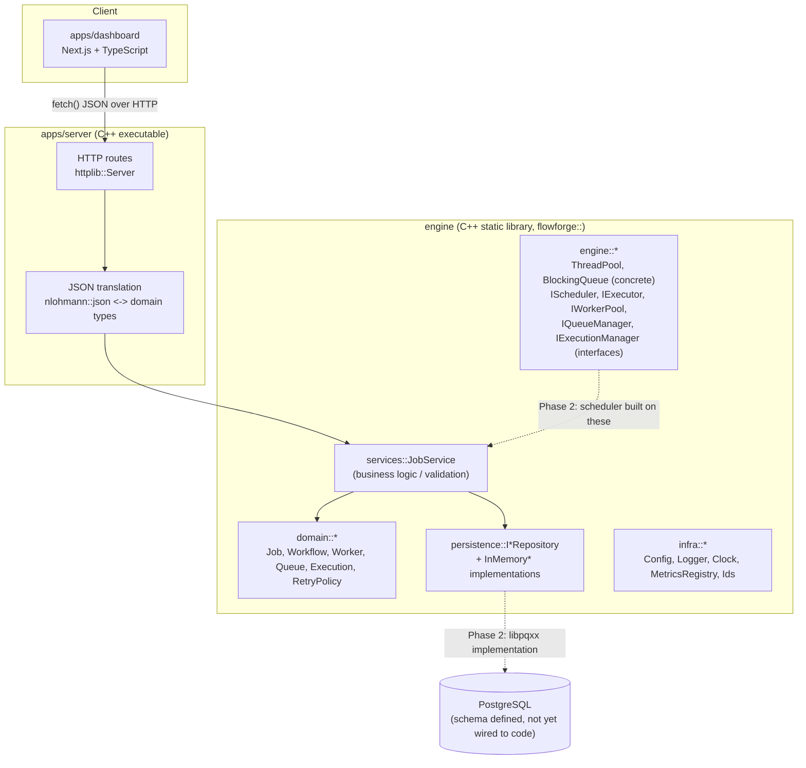

# FlowForge Architecture Overview

This document describes the Phase 1 foundation: what exists, why it's shaped the way it is, and what
is deliberately deferred. It is written to stay accurate as the system grows — when a deferred item is
implemented, update the relevant section rather than leaving it stale.

## 1. Components and responsibilities



| Component | Location | Responsibility | Depends on |
|---|---|---|---|
| `flowforge_engine` | `engine/` | Domain model, business logic (`JobService`), concurrency primitives, persistence interfaces + in-memory implementations, infra (config/logging/clock/metrics/ids) | spdlog only |
| `flowforge_server` | `apps/server/` | HTTP transport: routing, JSON (de)serialization, error-code-to-HTTP-status mapping | `flowforge_engine`, httplib, nlohmann::json |
| `apps/dashboard` | `apps/dashboard/` | Operator UI: real data where an endpoint exists, explicit "not yet implemented" placeholders where it doesn't | `packages/shared`, the running `flowforge_server` over HTTP |
| `packages/shared` | `packages/shared/` | Hand-written TypeScript types mirroring the JSON wire contracts in `apps/server/src/json` | none (consumed by dashboard) |
| `database/migrations` | `database/` | PostgreSQL schema, applied by `scripts/db-migrate.sh` | PostgreSQL only (no ORM) |

## 2. Dependency direction

```
apps/dashboard  --(HTTP/JSON)-->  apps/server  -->  engine  -->  (spdlog)
                                                        ^
                                          database/migrations (schema only,
                                          not yet linked to engine code)
```

The engine never depends on the server, and never depends on a JSON or HTTP library. This is
enforced structurally, not just by convention: `engine/CMakeLists.txt` only links `spdlog`, and
`domain::Job::payload()` is a plain `std::string` rather than an `nlohmann::json` value specifically
so the domain model has no serialization dependency. The benefit shows up now, not just later:
`engine/tests` exercises the full domain/service/persistence stack with zero HTTP server involved,
and `flowforge_engine` could back a CLI or a gRPC endpoint later without modification.

## 3. Data flow: creating a job (the one fully-wired path today)

1. `POST /api/v1/jobs` arrives at `apps/server/src/http/routes/job_routes.cpp`.
2. The handler parses the JSON body via `apps/server/src/json/job_json.cpp`
   (`parse_create_job_request`), which only checks *shape* (types, required fields).
3. `services::JobService::create_job` (`engine/src/services/job_service.cpp`) enforces *business*
   validation (non-empty queue name, payload size limits, `max_attempts >= 1`) and constructs a
   `domain::Job`.
4. The job is written through `persistence::IJobRepository` to the `InMemoryJobRepository`
   (`engine/src/persistence/in_memory_repositories.cpp`) — thread-safe, real, but not durable across
   a process restart.
5. The route handler serializes the resulting `domain::Job` back to JSON and returns `201 Created`.

Nothing in this path touches a scheduler, queue, or worker — creating a job records it; nothing
executes it yet. That is the Phase 2 boundary (see §5).

## 4. Error handling strategy

FlowForge does not use exceptions for expected, recoverable failures. Every fallible engine/service
function returns `Result<T>` (`engine/include/flowforge/result.hpp`), an alias for
`std::expected<T, Error>` (C++23). `Error` (`engine/include/flowforge/error.hpp`) carries an
`ErrorCode` — `Validation`, `Configuration`, `Infrastructure`, `Database`, `Network`,
`JobExecution`, `NotFound`, `Conflict`, `Internal` — plus a human-readable message.

Why: a job engine that silently drops or half-handles a failure is worse than useless — it looks
like it's working. Making failure part of the return type forces every call site to make an explicit
choice (propagate, map to an HTTP status, retry) instead of a failure mode being an afterthought
bolted on via `try`/`catch` at some ancestor frame. `apps/server/src/http/error_response.cpp` is the
single place that maps `ErrorCode -> HTTP status`, so every endpoint is consistent by construction.

Exceptions are still used, deliberately, for programming errors and truly exceptional conditions:
- `ThreadPool::submit()` throws `std::runtime_error` if called after `stop()` — that's a caller bug,
  not a recoverable runtime state.
- `std::bad_alloc` and similar are allowed to propagate and terminate the process.

## 5. What's real vs. interface-only in this phase

| Area | Status |
|---|---|
| Domain types (`Job`, `Workflow`, `Worker`, `QueueConfig`, `Execution`, `RetryPolicy`) | **Real.** Full value types with invariants (e.g. `RetryPolicy::compute_backoff`, `Job::record_attempt_failure`), unit tested. |
| `ThreadPool`, `BlockingQueue<T>` | **Real, tested, benchmarked.** The concrete concurrency primitives the future scheduler will be built on. |
| `IScheduler`, `IExecutor`, `IWorkerPool`, `IQueueManager`, `IExecutionManager` | **Interfaces only.** No implementation exists; see §6. Building them requires design decisions (single vs. multi-queue dispatch, how cancellation interrupts in-flight work) that are Phase 2 scope. |
| `IJobRepository` / `InMemoryJobRepository` | **Real**, backs the running server today. Not durable across restarts — see §7 for why PostgreSQL isn't wired up yet. |
| `IWorkflowRepository`, `IWorkerRepository` | **Real but unused for writes** — `GET /api/v1/workflows` and `GET /api/v1/workers` return real (always-empty) data; nothing creates rows in these repositories yet. |
| `JobService` (create/get/list/cancel) | **Real**, full validation, real HTTP integration test coverage (`apps/server/tests/http_server_test.cpp`). |
| `MetricsRegistry` | **Real, in-memory**, backs `GET /metrics`. Rendered as plain `name value` text, not Prometheus exposition format — see §8. |
| PostgreSQL schema (`database/migrations/`) | **Real SQL**, designed and reviewed, but no C++ code executes it yet. |
| Dashboard pages: Overview, Jobs, Workflows (list), Workers (list), Metrics | **Real HTTP calls** to the running server. |
| Dashboard pages: Queues, Logs, Settings | **Explicit placeholders** (`NotYetImplemented` component) — no backing endpoint exists, and the page says so rather than showing empty tables that look like "no data yet" when it's really "no feature yet." |

## 6. Deferred to Phase 2 (and why)

- **Scheduler / Executor / WorkerPool implementations.** These require deciding the dispatch model
  (e.g. one `ThreadPool` per queue vs. shared, how priority ordering interacts with per-queue
  capacity) — a design task, not a small addition to what exists. `IScheduler` etc. exist so this can
  be built and unit-tested against the existing domain/persistence layers without a redesign.
- **Job execution.** There is no pluggable "job handler" registry yet (mapping a job's queue/type to
  runnable code), no timeout enforcement, no cancellation-while-running support. `IExecutor` is the
  seam this will be built behind.
- **PostgreSQL persistence.** The schema is fully designed (§7 below), but no `libpqxx`-backed
  `IJobRepository` implementation exists. Swapping it in touches one new file per repository, not
  call sites, because everything already codes against the `I*Repository` interfaces.
- **Workflow execution / DAG scheduling**, including cycle detection over `workflow_step_dependencies`.
- **Worker process registration/heartbeating** as a separate deployable (`services/workers/` exists
  as a placeholder directory for this).
- **Prometheus-format `/metrics`** and any real exporter (OpenTelemetry, StatsD, etc.) — the
  `MetricsRegistry` interface is metrics-vendor-neutral specifically so this is a rendering-layer
  change, not an instrumentation-call-site change.
- **Authentication/authorization** on the API. Endpoints are unauthenticated in this phase; see
  `docs/architecture/overview.md` §9 for the intended seam.
- **Rate limiting, dead-letter queue processing, graceful drain of in-flight jobs on shutdown** beyond
  the HTTP server's own graceful stop (`App::stop()`).

## 7. Persistence model

The schema (`database/migrations/0001`-`0009`) mirrors the domain model directly:

- `queues` — logical queue configuration (name, capacity, priority).
- `jobs` — one row per job; `retry_policy` stored as `jsonb` since it's always read/written as a
  unit and this avoids a migration every time the policy grows a field.
- `job_attempts` — one row per execution attempt (mirrors `domain::Execution`); `UNIQUE (job_id,
  attempt_number)`.
- `workers` — worker process metadata.
- `workflows` / `workflow_steps` / `workflow_step_dependencies` — the DAG is represented as an edge
  table (`step_id`, `depends_on_step_id`) rather than an array column, so referential integrity is
  enforced by foreign keys.
- `audit_logs` — generic append-only trail across entity types, intentionally not foreign-keyed to
  any single entity table so audit history survives entity deletion.

`scripts/db-migrate.sh` / `.ps1` is a small, dependency-free runner: it applies files from
`database/migrations/` in filename order, tracked in a `schema_migrations` table. This was chosen
over a Node/Go migration framework because FlowForge's migrations are plain numbered SQL and pulling
in another language's tooling to run them would be more moving parts than the problem warrants.
Revisit if down-migrations or branching migration history become necessary.

## 8. Observability

`infra::MetricsRegistry` (`engine/include/flowforge/infra/metrics.hpp`) is a small,
vendor-neutral counter/gauge/histogram interface. `InMemoryMetricsRegistry` is a real, thread-safe
implementation and currently backs `GET /metrics`, rendered as plain text
(`name_total value` / `name value` / `name_count`, `name_sum`, `name_min`, `name_max`) — not the
Prometheus exposition format. The interface is written so a Prometheus/OpenTelemetry exporter can be
swapped in later as a rendering change, not an instrumentation-call-site change across the codebase.

Structured logging (`infra::Logger`) is a facade over spdlog (`engine/src/infra/logger.cpp`), chosen
so application code never calls spdlog directly and a backend swap doesn't ripple through call sites.
`FLOWFORGE_STRUCTURED_LOGGING=true` emits one JSON object per line (production); `false` emits a
human-readable colorized line (development). Every log call takes an explicit `component` string.

## 9. Security baseline (this phase)

- No secrets are committed; `.env.example` documents required variables with placeholder values only.
- `AppConfig::load` fails startup with a clear `Configuration` error rather than falling back to an
  insecure default when `FLOWFORGE_DATABASE_URL` is missing outside development/test.
- Request bodies are shape-validated before touching business logic; validation failures return `400`
  with a message, never a stack trace or internal error detail.
- The Docker images run as a non-root user (`infra/docker/Dockerfile.server`,
  `Dockerfile.dashboard`).
- **Not yet implemented**: authentication/authorization on any endpoint. Every `/api/v1/*` route is
  currently open. The seam for this is `apps/server/src/http/app.cpp::register_routes` — an auth
  middleware/handler would wrap route registration here. This is called out explicitly rather than
  left implicit because an unauthenticated job-submission API is not something to ship past a
  development environment.

## 10. Scalability model (future direction, not yet built)

The concurrency primitives (`ThreadPool`, `BlockingQueue<T>`) are in-process only. The intended future
shape (not yet implemented) is: multiple `flowforge_server` instances behind a load balancer sharing
one PostgreSQL database as the source of truth, with `job_attempts.worker_id` and row-level locking
(`SELECT ... FOR UPDATE SKIP LOCKED`) used for cross-process job claiming once the scheduler exists.
Nothing in the current schema or interfaces blocks that design, but nothing implements it yet either.

## 11. Toolchain notes

- **Compiler**: the WinLibs UCRT+LLVM distribution bundles both GCC 14 and clang 19 on the current
  Windows development machine. **g++ is the working local compiler on Windows**: clang targeting
  `x86_64-w64-mingw32` against this libstdc++ has a reproducible linker bug (`relocation truncated to
  fit: IMAGE_REL_AMD64_SECREL` against `std::__once_call`/`std::__once_callable`) that breaks any
  binary transitively using `std::call_once` (which `std::future`/`std::async` use internally) — see
  `engine/tests` linking `flowforge_engine_tests`, which fails under clang++ and succeeds under g++
  with an otherwise-identical CMake configuration. This is a Windows-COFF-specific clang/libstdc++
  ABI incompatibility, not a FlowForge code issue, and does not reproduce on Linux. clang remains the
  tool for `clang-format`/`clang-tidy` on this machine, and CI builds with clang on Ubuntu (unaffected
  by this bug, since it's specific to COFF TLS relocations).
- **Build system**: CMake + Ninja, with all third-party dependencies (spdlog, nlohmann::json,
  cpp-httplib, GoogleTest, Google Benchmark) fetched via `FetchContent` rather than assuming a system
  package manager (vcpkg/conan) is present — see root `CMakeLists.txt` for the rationale.
- **HTTP library**: `cpp-httplib` — single-header, synchronous, no external dependencies (no OpenSSL
  required for plain HTTP). Chosen for this phase's scope (a handful of JSON endpoints); revisit if
  the server needs true async I/O at scale.
