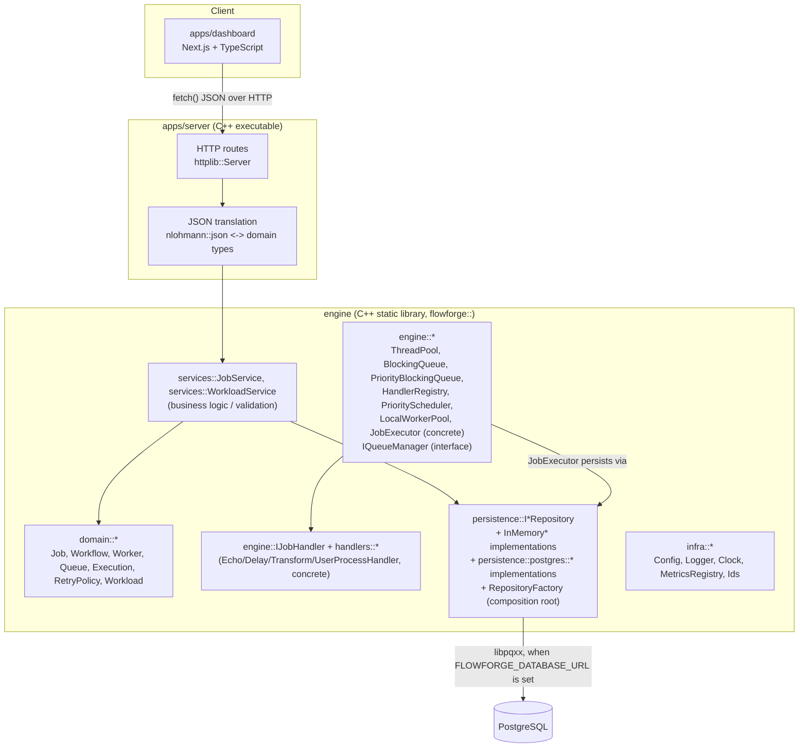

# FlowForge Architecture Overview

This document describes FlowForge's architecture through Phase 3B (User Import): what exists, why
it's shaped the way it is, and what is deliberately deferred. See
[`execution-model.md`](execution-model.md) for the job execution/retry pipeline in full detail
(§1–§21), [`workload-model.md`](workload-model.md) for the generic Workload/Batch abstraction
(Phase 3A), and [`user-import.md`](user-import.md) for User Import (Phase 3B: CSV upload, the
`/users`/`/workloads/{id}` dashboard pages, and the queued/running/succeeded/failed progress
breakdown) in full detail — this document stays at the component/dependency-direction level. It is
written to stay accurate as the system grows — when a deferred item is implemented, update the
relevant section rather than
leaving it stale.

## 1. Components and responsibilities



See [`execution-model.md`](execution-model.md) for the job lifecycle, handler abstraction,
`HandlerRegistry`, `PriorityScheduler`, `LocalWorkerPool`, and `JobExecutor` in detail
(Phase 2B-1 through 2B-3).

| Component | Location | Responsibility | Depends on |
|---|---|---|---|
| `flowforge_engine` | `engine/` | Domain model, business logic (`JobService`), concurrency primitives, persistence interfaces + in-memory implementations, infra (config/logging/clock/metrics/ids) | spdlog only |
| `flowforge_server` | `apps/server/` | HTTP transport: routing, JSON (de)serialization, error-code-to-HTTP-status mapping | `flowforge_engine`, httplib, nlohmann::json |
| `apps/dashboard` | `apps/dashboard/` | Operator UI: real data where an endpoint exists, explicit "not yet implemented" placeholders where it doesn't | `packages/shared`, the running `flowforge_server` over HTTP |
| `packages/shared` | `packages/shared/` | Hand-written TypeScript types mirroring the JSON wire contracts in `apps/server/src/json` | none (consumed by dashboard) |
| `database/migrations` | `database/` | PostgreSQL schema, applied by `scripts/db-migrate.sh` | PostgreSQL only (no ORM) |

## 2. Dependency direction

```
apps/dashboard  --(HTTP/JSON)-->  apps/server  -->  engine  -->  (spdlog)
                                                        ^
                                          database/migrations (schema only,
                                          not yet linked to engine code)
```

The engine never depends on the server, and never depends on a JSON or HTTP library. This is
enforced structurally, not just by convention: `engine/CMakeLists.txt` only links `spdlog`, and
`domain::Job::payload()` is a plain `std::string` rather than an `nlohmann::json` value specifically
so the domain model has no serialization dependency. The benefit shows up now, not just later:
`engine/tests` exercises the full domain/service/persistence stack with zero HTTP server involved,
and `flowforge_engine` could back a CLI or a gRPC endpoint later without modification.

## 3. Data flow: creating a job (the one fully-wired path today)

1. `POST /api/v1/jobs` arrives at `apps/server/src/http/routes/job_routes.cpp`.
2. The handler parses the JSON body via `apps/server/src/json/job_json.cpp`
   (`parse_create_job_request`), which only checks *shape* (types, required fields).
3. `services::JobService::create_job` (`engine/src/services/job_service.cpp`) enforces *business*
   validation (non-empty queue name, payload size limits, `max_attempts >= 1`) and constructs a
   `domain::Job`.
4. The job is written through `persistence::IJobRepository` to the `InMemoryJobRepository`
   (`engine/src/persistence/in_memory_repositories.cpp`) — thread-safe, real, but not durable across
   a process restart.
5. The route handler serializes the resulting `domain::Job` back to JSON and returns `201 Created`.

Nothing in this path touches a scheduler, queue, or worker — creating a job records it; nothing
executes it yet. That is the Phase 2 boundary (see §5).

## 4. Error handling strategy

FlowForge does not use exceptions for expected, recoverable failures. Every fallible engine/service
function returns `Result<T>` (`engine/include/flowforge/result.hpp`), an alias for
`std::expected<T, Error>` (C++23). `Error` (`engine/include/flowforge/error.hpp`) carries an
`ErrorCode` — `Validation`, `Configuration`, `Infrastructure`, `Database`, `Network`,
`JobExecution`, `NotFound`, `Conflict`, `Internal` — plus a human-readable message.

Why: a job engine that silently drops or half-handles a failure is worse than useless — it looks
like it's working. Making failure part of the return type forces every call site to make an explicit
choice (propagate, map to an HTTP status, retry) instead of a failure mode being an afterthought
bolted on via `try`/`catch` at some ancestor frame. `apps/server/src/http/error_response.cpp` is the
single place that maps `ErrorCode -> HTTP status`, so every endpoint is consistent by construction.

Exceptions are still used, deliberately, for programming errors and truly exceptional conditions:
- `ThreadPool::submit()` throws `std::runtime_error` if called after `stop()` — that's a caller bug,
  not a recoverable runtime state.
- `std::bad_alloc` and similar are allowed to propagate and terminate the process.

## 5. What's real vs. interface-only in this phase

| Area | Status |
|---|---|
| Domain types (`Job`, `Workflow`, `Worker`, `QueueConfig`, `Execution`, `RetryPolicy`) | **Real.** Full value types with invariants (e.g. `RetryPolicy::compute_backoff`, `Job::record_attempt_failure`), unit tested. |
| `ThreadPool`, `BlockingQueue<T>` | **Real, tested, benchmarked.** The concrete concurrency primitives the future scheduler will be built on. |
| `IQueueManager` | **Interface only.** No implementation exists — `PriorityScheduler`'s internal `PriorityBlockingQueue` covers the need this phase, and nothing yet requires a general-purpose queue-management abstraction. |
| `IJobHandler`, `ExecutionContext`, `domain::ExecutionResult`, `HandlerRegistry`, built-in handlers (`echo`/`delay`/`transform`) | **Real (Phase 2B-1).** See [`execution-model.md`](execution-model.md). |
| `IScheduler` (`engine::PriorityScheduler`) | **Real (Phase 2B-2).** A bounded, priority-ordered, in-memory dispatch queue: validates a job, resolves its handler via `HandlerRegistry`, dispatches to `IWorkerPool`. Wired into `apps/server` (`App::create()` starts it; `POST /api/v1/jobs` submits to it when `job_type` is set). |
| `IWorkerPool` (`engine::LocalWorkerPool`), `IExecutor` (`engine::JobExecutor`) | **Real (Phase 2B-3).** A job dispatched by the Scheduler is genuinely executed: `Queued -> Running -> Succeeded`/`Failed`/`Cancelled`, with a real `job_attempts` row per attempt. See [`execution-model.md`](execution-model.md) §10–§17. |
| `IExecutionManager` (`InMemoryExecutionRepository` / `postgres::PostgresExecutionRepository`) | **Real (Phase 2B-3).** `job_attempts` persistence — see execution-model.md §12–§13. |
| `IJobRepository` / `IWorkflowRepository` / `IWorkerRepository` | **Real, two implementations.** `InMemoryJobRepository` etc. (process-local, not durable — kept for fast unit tests and as the development-mode default) and `postgres::PostgresJobRepository` etc. (libpqxx-backed, durable). Selected at startup by `persistence::create_repositories` — see §7. |
| `IWorkflowRepository` writes | **Real for the backend**, but nothing in the HTTP API creates workflow rows yet (`GET /api/v1/workflows` is the only route) — workflow execution remains future scope. `IWorkerRepository` writes are real and used: `LocalWorkerPool` registers one row per worker at startup (Phase 2B-3). |
| `JobService` (create/get/list/cancel/mark_queued) | **Real**, full validation, real HTTP integration test coverage (`apps/server/tests/http_server_test.cpp`), against both persistence backends. |
| `domain::Workload`, `IWorkloadRepository`, `WorkloadService`, `handlers::UserProcessHandler` | **Real** — see [`workload-model.md`](workload-model.md) and [`user-import.md`](user-import.md). `POST`/`GET /api/v1/workloads` creates a workload and dispatches one job per item through the existing `JobService`/`PriorityScheduler` (no new scheduler/executor); `POST /api/v1/workloads/user-imports` (Phase 3B) does the same from an uploaded CSV. Progress (`queued_items`/`running_items`/`completed_items`/`failed_items`) is computed live from child `Job` rows, never a separately-persisted counter. The `/users` and `/workloads/{id}` dashboard pages are real (Phase 3B). |
| `MetricsRegistry` | **Real, in-memory**, backs `GET /metrics`. Rendered as plain `name value` text, not Prometheus exposition format — see §8. |
| PostgreSQL schema (`database/migrations/`) | **Real SQL, and now wired up** — `persistence::postgres::*` executes every migrated table via parameterized queries. See §7. |
| Dashboard pages: Overview, Jobs, Workflows (list), Workers (list), Metrics | **Real HTTP calls** to the running server. |
| Dashboard pages: Queues, Logs, Settings | **Explicit placeholders** (`NotYetImplemented` component) — no backing endpoint exists, and the page says so rather than showing empty tables that look like "no data yet" when it's really "no feature yet." |

## 6. Deferred to future phases (and why)

- **Job execution.** Now real end-to-end (Phase 2B-1 through 2B-3 — see
  [`execution-model.md`](execution-model.md)): a job with a `job_type` is validated, resolved
  against `HandlerRegistry`, dispatched via `PriorityScheduler` to `LocalWorkerPool`, and actually
  executed by `JobExecutor` through `IJobHandler::execute()`, with a real `Queued -> Running ->
  Succeeded`/`Failed`/`Cancelled` transition and a persisted `job_attempts` row per attempt.
  Cancellation and a per-attempt timeout are both real, but purely cooperative (never a forced
  thread kill) — see execution-model.md §14–§16 for exactly what that does and does not guarantee.
  A retry engine is also now real (Phase 2B-4 — `engine::RetryDispatcher` re-submits a
  retryable-failed job through `RetryPolicy::compute_backoff()`'s exponential backoff; exhausted
  retries land on `DeadLetter`), and `/ready`/metrics/logging now honestly reflect the whole
  pipeline's real-time state (Phase 2B-5) — see execution-model.md §18–§21. **Still deferred**:
  workflow DAG execution.
- **Workflow execution / DAG scheduling**, including cycle detection over `workflow_step_dependencies`.
- **Distributed/multi-process worker coordination.** `LocalWorkerPool` (Phase 2B-3) is real but
  in-process/local only — nothing yet coordinates job claiming across multiple `flowforge_server`
  instances (see §10, "Scalability model").
- **Prometheus-format `/metrics`** and any real exporter (OpenTelemetry, StatsD, etc.) — the
  `MetricsRegistry` interface is metrics-vendor-neutral specifically so this is a rendering-layer
  change, not an instrumentation-call-site change.
- **Authentication/authorization** on the API. Endpoints are unauthenticated in this phase; see
  `docs/architecture/overview.md` §9 for the intended seam.
- **Rate limiting, dead-letter queue processing, graceful drain of in-flight jobs on shutdown** beyond
  the HTTP server's own graceful stop (`App::stop()`).
- **An executor-side workload-progress callback, asynchronous workload submission, chunked/streamed
  CSV upload, server-push progress updates, workload deletion, and other concrete workload types**
  (image processing, email jobs, report generation, webhook processing, data exports) beyond User
  Import — see [`workload-model.md`](workload-model.md) §9 and [`user-import.md`](user-import.md)
  §12 for the full deferred list and rationale.

## 7. Persistence model and PostgreSQL architecture (Phase 2A)

### 7.1 Schema

The schema (`database/migrations/0001`-`0010`) mirrors the domain model directly:

- `queues` — logical queue configuration (name, capacity, priority). Nothing manages this table's
  contents directly yet (no `IQueueRepository`); `PostgresJobRepository::insert` upserts a `queues`
  row for whatever `queue_name` a job specifies, since `jobs.queue_name` has a foreign key to it and
  no other component creates queues in this phase (see §7.4).
- `jobs` — one row per job; `retry_policy` stored as `jsonb` since it's always read/written as a
  unit and this avoids a migration every time the policy grows a field. `job_type` (migration
  `0011`, Phase 2B-2) is `TEXT NOT NULL DEFAULT ''`: `domain::Job` gained the field in Phase 2B-1
  for the handler abstraction (see [`execution-model.md`](execution-model.md) §4) but it stayed
  unpersisted until `PriorityScheduler` needed to read it back off a stored job.
- `job_attempts` — one row per execution attempt (mirrors `domain::Execution`); `UNIQUE (job_id,
  attempt_number)`. Written to for real as of Phase 2B-3, by `JobExecutor` via
  `persistence::postgres::PostgresExecutionRepository` (`engine::IExecutionManager`) — see
  [`execution-model.md`](execution-model.md) §12–§13.
- `workers` — worker process metadata. Populated for real as of Phase 2B-3: `LocalWorkerPool`
  registers one row per local worker thread at startup (`worker-1`, `worker-2`, ...) via the
  existing `IWorkerRepository` — see execution-model.md §10.4.
- `workflows` / `workflow_steps` / `workflow_step_dependencies` — the DAG is represented as an edge
  table (`step_id`, `depends_on_step_id`) rather than an array column, so referential integrity is
  enforced by foreign keys. Migration 0010 adds `workflow_steps.position`: all steps of one workflow
  are inserted in a single transaction, and PostgreSQL's `now()` is transaction-stable, so every step
  in that transaction gets an identical `created_at` — `position` is what makes `Workflow::steps()`'s
  order round-trip correctly.
- `audit_logs` — generic append-only trail across entity types, intentionally not foreign-keyed to
  any single entity table so audit history survives entity deletion. No repository writes to this
  table yet.
- `workloads` (migration 0012, Phase 3A) — one row per workload (`id`/`type`/`total_items`/
  timestamps only; deliberately no `status`/`completed_items`/`failed_items` columns — see
  [`workload-model.md`](workload-model.md) §3). `jobs.workload_id` (migration 0013) is a nullable
  foreign key back to it, `ON DELETE SET NULL` — see workload-model.md §5.

`scripts/db-migrate.sh` / `.ps1` is a small, dependency-free runner: it applies files from
`database/migrations/` in filename order, tracked in a `schema_migrations` table. This was chosen
over a Node/Go migration framework because FlowForge's migrations are plain numbered SQL and pulling
in another language's tooling to run them would be more moving parts than the problem warrants.
Revisit if down-migrations or branching migration history become necessary.

### 7.2 Dependency direction and code layout

```
domain::*  <--  persistence::I*Repository (interfaces)  <--  persistence::postgres::* (implementation)
                                                          <--  persistence::In*Repository (implementation)
```

`persistence::postgres::*` lives under `engine/include/flowforge/persistence/postgres/` and
`engine/src/persistence/postgres/`. The domain layer (`domain::*`) and the repository *interfaces*
(`IJobRepository` etc.) have zero dependency on libpqxx — only the postgres implementation files
`#include <pqxx/pqxx>`. `JobService`, the HTTP routes, and every unit test that uses
`InMemoryJobRepository` are unaffected by whether PostgreSQL support is compiled in at all.

The whole PostgreSQL layer is conditionally compiled behind the CMake option
`FLOWFORGE_WITH_POSTGRES` (default `ON`, auto-detected: it degrades to `OFF` with a loud
`message(WARNING)` — never silently — if `find_package(PostgreSQL)` can't find libpq). See
`docs/development/getting-started.md`, "PostgreSQL setup", for what to install.

### 7.3 Connection management

`persistence::postgres::PgConnectionPool` (`connection_pool.hpp`) is a small, real, thread-safe fixed-
size connection pool: `PgConnectionPool::create()` opens `pool_size` connections eagerly and verifies
each with `is_open()`, so a bad connection string or unreachable database fails at startup, not on the
first request (the "startup connectivity validation" every repository call ultimately depends on).
`acquire()` returns an RAII `LeasedConnection` that returns the connection to the pool on destruction
(built on `engine::BlockingQueue<T>` — the same primitive `ThreadPool` uses — as the free list), so a
repository method can never leak a connection, including on an exception.

This is deliberately the simplest pool that's still correct: fixed size, no acquire timeout, no
dynamic growth. That's a known limitation, accepted for this phase because nothing yet drives
sustained concurrent load against it (no Scheduler/WorkerPool exists — see §6). `acquire()`'s
`Result<LeasedConnection>` return type already accommodates a future timeout becoming a real error
path without changing any repository's code.

### 7.4 Transaction strategy

Every repository method acquires one connection, opens one `pqxx::work` (libpqxx's RAII transaction
type — commits only on an explicit `.commit()`, rolls back automatically if the transaction is
destroyed without one, including via an in-flight exception), does its parameterized query/queries,
and commits before returning. `PostgresWorkflowRepository::insert()` is the clearest example of why
this matters: it writes the `workflows` row, every `workflow_steps` row, and every
`workflow_step_dependencies` edge in one transaction, so a failure partway through (e.g. a step
referencing a `job_id` that doesn't exist) leaves nothing behind — not the workflow, not any step —
rather than a half-written DAG. `PostgresJobRepository::insert()` similarly upserts the job's `queues`
row and inserts the `jobs` row together: nothing in this phase populates `queues` ahead of time (no
`IQueueRepository` exists), so the job repository provisions it transactionally rather than requiring
every job creation path to remember to do so, or making `jobs.queue_name`'s foreign key optional.

### 7.5 Data mapping decisions

- **Timestamps**: bound/read as fractional seconds since the Unix epoch (`extract(epoch from col)` /
  `to_timestamp($n)`), not formatted/parsed ISO-8601 strings. This sidesteps timezone-format parsing
  entirely on both sides of the round trip.
- **`job.payload`**: `domain::Job::payload()` is deliberately an opaque, already-serialized string
  (see `job.hpp`) — not guaranteed to itself be valid JSON. Binding it straight into `jobs.payload
  ::jsonb` would throw on a non-JSON payload. Instead, writes use `to_jsonb($n::text)` (wraps *any*
  string as a valid JSON string scalar) and reads use `payload #>> '{}'` (unwraps it back to the exact
  original text) — the `jsonb` column type from migration 0005 is unchanged, only how it's populated.
- **`job.retry_policy`**: a small hand-rolled JSON encoder/decoder (in
  `postgres_job_repository.cpp`, not a public header) rather than adding `nlohmann::json` as an engine
  dependency for four numeric fields. The decoder looks each key up by name — PostgreSQL's `jsonb`
  storage does not preserve the key order or spacing it was written with.
- **`domain::Job::restore(...)`**: a new, additive static factory on `Job` (alongside the existing
  constructor and `transition_to`/`record_attempt_*`) that reconstructs a `Job` from arbitrary
  persisted state — status, attempt_count, last_error, timestamps — in one call. It deliberately does
  not reuse `transition_to`/`record_attempt_*`: those encode the business rules for deciding a *new*
  transition (e.g. consulting `retry_policy` to decide `Retrying` vs. `DeadLetter`), which is the
  wrong thing to run again when restoring a row that already recorded a decided outcome.
  `domain::Workflow` and `domain::Worker` needed no equivalent change — `transition_to` /
  `heartbeat()`+`set_status()` were already sufficient to restore their full state.

### 7.6 Error mapping

`persistence::postgres::map_exception(e, context)` (`error_mapping.hpp`) turns a caught exception into
FlowForge's `Error` type, matching pqxx's exception hierarchy: `unique_violation` → `Conflict`,
`foreign_key_violation`/`check_violation`/`not_null_violation` → `Validation`, `broken_connection` →
`Infrastructure`, any other `sql_error` → `Database`. The returned `Error`'s message is a short,
context-labeled description (e.g. `"job_repository.insert: a record with this identity already
exists"`) for every classified pqxx exception type. `map_exception`'s fallback branch (an
exception pqxx doesn't specifically classify) does still embed the raw `e.what()` into that
`Error`, which is exactly why Phase 2B-5 added a second, unconditional backstop at the HTTP layer
(`apps/server/src/http/error_response.cpp::to_error_body()`, see execution-model.md §20.7): any
error whose HTTP status is 5xx has its message replaced with a fixed, generic string before it
ever reaches a response body, regardless of which branch of `map_exception` produced it. Every
repository method still logs the full exception (`e.what()`) via `infra::Logger` before mapping
it, so that detail isn't lost, just kept server-side.

### 7.7 Repository selection (composition root)

`persistence::create_repositories(config, logger, metrics)` (`repository_factory.hpp`/`.cpp`) is the
one place that decides in-memory vs. PostgreSQL, based purely on whether `config.database_url` is set
— never on the environment name. `AppConfig::load` already requires `FLOWFORGE_DATABASE_URL` outside
development/test, so staging/production always take the PostgreSQL path; a developer can opt into it
locally too by setting the same variable. If PostgreSQL is requested (`database_url` set) and
unreachable, `create_repositories` returns an `Error` — there is no fallback path in the code at all,
so `App::create()` (see §14 in `getting-started.md`'s startup description) fails startup cleanly rather
than serving requests against a broken or substitute backend.

`apps/server/src/http/app.cpp` calls `create_repositories()` once at startup and stores the results as
`shared_ptr<IJobRepository>` etc. — `JobService` and the HTTP routes never know which backend they're
talking to.

## 8. Observability

`infra::MetricsRegistry` (`engine/include/flowforge/infra/metrics.hpp`) is a small,
vendor-neutral counter/gauge/histogram interface. `InMemoryMetricsRegistry` is a real, thread-safe
implementation and currently backs `GET /metrics`, rendered as plain text
(`name_total value` / `name value` / `name_count`, `name_sum`, `name_min`, `name_max`) — not the
Prometheus exposition format. The interface is written so a Prometheus/OpenTelemetry exporter can be
swapped in later as a rendering change, not an instrumentation-call-site change across the codebase.

Structured logging (`infra::Logger`) is a facade over spdlog (`engine/src/infra/logger.cpp`), chosen
so application code never calls spdlog directly and a backend swap doesn't ripple through call sites.
`FLOWFORGE_STRUCTURED_LOGGING=true` emits one JSON object per line (production); `false` emits a
human-readable colorized line (development). Every log call takes an explicit `component` string.

`GET /health` (liveness) and `GET /ready` (readiness) are distinct on purpose (Phase 2B-5 made
this real, not just documented): `/health` never depends on anything external and always answers
"ok" as long as the HTTP server itself is up; `/ready` performs cheap, non-blocking checks against
PostgreSQL, the scheduler, the worker pool, and the retry dispatcher, and returns `503` the moment
any one is unavailable. See execution-model.md §20.4 for the full contract and exactly what each
check does and does not detect.

## 9. Security baseline (this phase)

- No secrets are committed; `.env.example` documents required variables with placeholder values only.
- `AppConfig::load` fails startup with a clear `Configuration` error rather than falling back to an
  insecure default when `FLOWFORGE_DATABASE_URL` is missing outside development/test.
- Request bodies are shape-validated before touching business logic; validation failures return `400`
  with a message, never a stack trace or internal error detail.
- The Docker images run as a non-root user (`infra/docker/Dockerfile.server`,
  `Dockerfile.dashboard`).
- **PostgreSQL persistence (§7)**: every query is parameterized (`pqxx::work::exec_params`/`params` —
  see `postgres_*_repository.cpp`); nothing in the persistence layer builds SQL by concatenating a
  value into query text. `FLOWFORGE_DATABASE_URL` (which can contain a password) is never logged —
  `PgConnectionPool` logs only the pool size, never the connection string. Database errors returned to
  API callers carry a short, generic message (§7.6); raw PostgreSQL error text (which can include
  query fragments) only ever reaches the server log, via `infra::Logger`, never an HTTP response body.
- **Not yet implemented**: authentication/authorization on any endpoint. Every `/api/v1/*` route is
  currently open. The seam for this is `apps/server/src/http/app.cpp::register_routes` — an auth
  middleware/handler would wrap route registration here. This is called out explicitly rather than
  left implicit because an unauthenticated job-submission API is not something to ship past a
  development environment.

## 10. Scalability model (future direction, not yet built)

The concurrency primitives (`ThreadPool`, `BlockingQueue<T>`) are in-process only. The intended future
shape (not yet implemented) is: multiple `flowforge_server` instances behind a load balancer sharing
one PostgreSQL database as the source of truth, with `job_attempts.worker_id` and row-level locking
(`SELECT ... FOR UPDATE SKIP LOCKED`) used for cross-process job claiming once the scheduler exists.
Nothing in the current schema or interfaces blocks that design, but nothing implements it yet either.

## 11. Toolchain notes

- **Compiler**: the WinLibs UCRT+LLVM distribution bundles both GCC 14 and clang 19 on the current
  Windows development machine. **g++ is the working local compiler on Windows**: clang targeting
  `x86_64-w64-mingw32` against this libstdc++ has a reproducible linker bug (`relocation truncated to
  fit: IMAGE_REL_AMD64_SECREL` against `std::__once_call`/`std::__once_callable`) that breaks any
  binary transitively using `std::call_once` (which `std::future`/`std::async` use internally) — see
  `engine/tests` linking `flowforge_engine_tests`, which fails under clang++ and succeeds under g++
  with an otherwise-identical CMake configuration. This is a Windows-COFF-specific clang/libstdc++
  ABI incompatibility, not a FlowForge code issue, and does not reproduce on Linux. clang remains the
  tool for `clang-format`/`clang-tidy` on this machine, and CI builds with clang on Ubuntu (unaffected
  by this bug, since it's specific to COFF TLS relocations).
- **Build system**: CMake + Ninja, with all third-party dependencies (spdlog, nlohmann::json,
  cpp-httplib, GoogleTest, Google Benchmark) fetched via `FetchContent` rather than assuming a system
  package manager (vcpkg/conan) is present — see root `CMakeLists.txt` for the rationale.
- **HTTP library**: `cpp-httplib` — single-header, synchronous, no external dependencies (no OpenSSL
  required for plain HTTP). Chosen for this phase's scope (a handful of JSON endpoints); revisit if
  the server needs true async I/O at scale.
- **PostgreSQL client library**: `libpqxx` 7.9.2, fetched via `FetchContent` like the other
  dependencies, but it links against `libpq` (the C client library), which libpqxx does not vendor —
  `libpq` must already be installed (see `docs/development/getting-started.md`, "PostgreSQL setup").
  This is the one deliberate exception to "no system package manager required" in this project (root
  `CMakeLists.txt` explains why building `libpq`+OpenSSL from source via `FetchContent` was judged not
  worth it). **Windows/MinGW-specific**: the official PostgreSQL Windows distribution ships `libpq.a`
  (a static archive that additionally requires OpenSSL's internal symbols, unavailable in a form this
  WinLibs/MinGW toolchain can link against) alongside `libpq.lib` (a thin import library for
  `libpq.dll`, which MinGW's linker consumes directly). CMake's `FindPostgreSQL` module finds the `.a`
  first; root `CMakeLists.txt` detects this on `WIN32` and repoints the `PostgreSQL::PostgreSQL`
  imported target at the `.lib` instead. This means `libpq.dll` must be on `PATH` at runtime on
  Windows (the PostgreSQL installer's `bin/` directory) — Linux/macOS link `libpq` normally with no
  such step, since apt/brew's `libpq` resolves its own OpenSSL dependency through the system linker.
