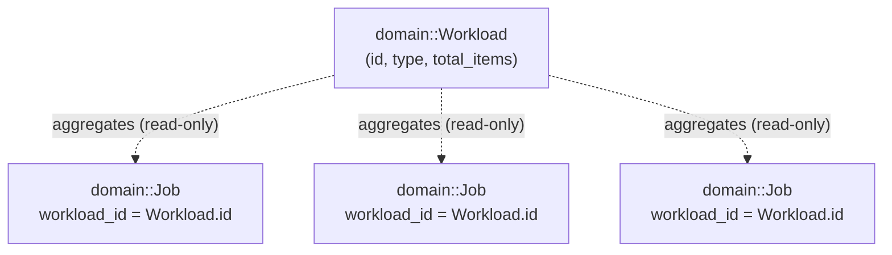

# FlowForge Workload Model (Phase 3A)

This document describes the Workload/Batch abstraction introduced in Phase 3A: what a Workload is,
why it exists, how it relates to `domain::Job`, its status lifecycle, and how User Import (the
first concrete workload type) is implemented on top of it. It complements
[`overview.md`](overview.md) (component/dependency-direction picture) and
[`execution-model.md`](execution-model.md) (the job execution pipeline a workload's jobs run
through unchanged) rather than replacing either.

## 1. What a Workload is, and why it exists

FlowForge was, through Phase 2B-5, an engine for individually-submitted jobs: `POST /api/v1/jobs`
creates and (optionally) schedules exactly one job. The product direction beyond Phase 2B-5 is
FlowForge processing real *workloads* -- a CSV of 50, 100, 500+ users, an image batch, a bulk
email send -- where a caller submits many related items as one logical unit and wants to track
that unit's aggregate progress, not poll N individual jobs by hand.

A `Workload` is that logical grouping: a batch of related jobs submitted together, with:

- `id`, `type` (see §4, "Why type == job_type"), `total_items`
- `completed_items`, `failed_items`, `status` -- all three **computed on demand** from the
  workload's child `Job` rows, never separately-persisted counters (see §3)
- `created_at`, `updated_at`

It is deliberately generic: nothing in `domain::Workload`, `IWorkloadRepository`, or
`WorkloadService` mentions "users". User Import is the first concrete *use* of the abstraction
(§4), not something baked into it -- the same abstraction is meant to carry image processing,
email jobs, report generation, webhook processing, and data exports in later phases without a
redesign.

## 2. Job remains the source of truth; Workload is aggregation



`Job` continues to own all execution state (`status`, `attempt_count`, `last_error`, retries) --
nothing about that changed in this phase. A `Job` gained one new, optional field:
`workload_id` (`std::optional<infra::WorkloadId>`, default `nullopt`). A job created directly via
`POST /api/v1/jobs` never sets it and behaves exactly as it did before Phase 3A -- this is a
purely additive, backward-compatible relationship (see §5 for the schema/FK details).

`Workload` never duplicates a job's execution state. It has no `status` column and no
`completed_items`/`failed_items` columns in PostgreSQL (migration `0012`) -- see §3.

## 3. Status derivation (deterministic, not incrementally maintained)

`WorkloadStatus` (`engine/include/flowforge/domain/workload.hpp`):

```
Pending -> Queued -> Running -> Succeeded
                  \-> Running -> Failed
```

- **Pending**: the domain object's default state (a freshly-constructed `Workload` before any
  progress has been computed against it).
- **Queued**: reserved for a future asynchronous submission flow (see §9) -- not observable via
  this phase's synchronous `WorkloadService::create_workload` (§4), which dispatches every item's
  job before returning, so a non-empty workload is already `Running` by the time a caller sees it.
- **Running**: at least one child job has not yet reached a terminal, decided outcome.
- **Succeeded**: every child job succeeded, or `total_items == 0` (a workload with nothing to do is
  vacuously complete -- there is no meaningful "Running" state for zero items).
- **Failed**: every child job reached a terminal outcome and at least one did not succeed. There is
  no partial-success status in this phase -- see the bullet list this mirrors, from the original
  phase brief:
  - all jobs succeeded -> Succeeded
  - some jobs still running/queued -> Running
  - failures with retryable jobs still active -> Running
  - terminal failures -> Failed
  - zero items -> handled explicitly (Succeeded)

The derivation is a pure function, `domain::derive_workload_status(total_items, completed_items,
failed_items)`, plus a classifier, `domain::classify_job_status_for_workload(JobStatus)`, that maps
each child job's current status into one of three buckets:

| `JobStatus`                                   | Bucket      | Why |
|---|---|---|
| `Succeeded`                                   | Completed   | Terminal and successful. |
| `Cancelled`, `DeadLetter`                     | Failed      | Terminal and unsuccessful. |
| `Pending`, `Queued`, `Running`, `Retrying`, **`Failed`** | Active | Not yet decided. |

`JobStatus::Failed` is deliberately in the *Active* bucket, not *Failed*: a failed **attempt** is
not terminal by itself (`domain::is_terminal(JobStatus::Failed) == false`) -- `RetryDispatcher` may
still retry it. It only becomes a workload-level failure once the job reaches `Cancelled` or
`DeadLetter` (retries exhausted).

**Why there is no `update()` on `IWorkloadRepository`, and no `status`/`completed_items`/
`failed_items` columns in `workloads`:** `WorkloadService::get_workload`/`list_workloads` compute
progress by querying `IJobRepository::list_by_workload_id` (bounded by `total_items`, which is
itself bounded at creation -- see §4) and applying the classifier + derivation function above, live,
on every call. This means:

- Progress can never drift out of sync with the `Job` rows that are the actual source of truth.
- No write path is needed on the job-execution hot path (`JobExecutor`) to keep a separate counter
  current under concurrency -- satisfying "workload aggregation must remain deterministic under
  concurrency" trivially, since it is a pure read-time computation over a point-in-time snapshot,
  not a counter mutated by multiple racing writers.
- The cost is an extra query per `GET`/`list` call (bounded, indexed via `idx_jobs_workload_id`) --
  see §8, "Known limitations", for the N+1-on-list tradeoff this implies at scale.

## 4. WorkloadService, and User Import as the first concrete workload

`services::WorkloadService` (`engine/include/flowforge/services/workload_service.hpp`) is the
application-level orchestrator, sitting at the same layer as `JobService` and deliberately reusing
it rather than duplicating job creation/scheduling logic.

`CreateWorkloadRequest { type, items[] }` -- `type` **doubles as the `job_type`** every item's `Job`
is created with. This is a deliberate simplification for this phase: there is exactly one handler
per workload type, so a second "workload type -> job type" mapping layer would be indirection with
no current benefit. A future workload type that needs to fan out to more than one job type per item
would need that mapping added explicitly then, not preemptively now.

`create_workload()`:

1. Validates `type` (non-empty, <= 128 chars) and `items` (<= 1000 entries, each a non-empty
   payload <= 64 KiB -- see §6 for where these numbers come from).
2. Persists the `Workload` row (`total_items = items.size()`).
3. For each item: builds a `Job` (`job_type = type`, `payload = item.payload`,
   `workload_id = <new workload's id>`) via `JobService::create_job`, then attempts
   `IScheduler::schedule()` and, on success, `JobService::mark_queued()` -- **the exact
   create-then-schedule sequence `POST /api/v1/jobs` already performs**
   (`apps/server/src/http/routes/job_routes.cpp`), applied once per item. A per-item failure (bad
   payload, unknown `job_type`, scheduler at capacity) is reported in that item's dispatch outcome
   and never aborts the loop or fails the whole call -- see "Partial failure during dispatch" below.
4. Returns the workload with live-computed progress (§3) plus each item's dispatch outcome.

**User Import (`user.process`)** is the first concrete workload type:
`handlers::UserProcessHandler` (`engine/include/flowforge/handlers/user_process_handler.hpp`),
registered under job type `"user.process"` (`register_builtin_handlers`). A caller creates a
`user.process` workload with one item per imported user; each item becomes one `user.process` job.
The handler validates/normalizes one user record deterministically:

```
Input:  {"name": "  Alice Khan ", "email": " ALICE@EXAMPLE.COM "}
Output: {"name": "Alice Khan", "email": "alice@example.com", "valid": true}
```

- `name`: required, trimmed, <= 200 chars, must not be blank after trimming.
- `email`: required, trimmed + lowercased, must look structurally like an email (exactly one `@`,
  non-empty local part, domain part containing an interior `.`), <= 320 chars.
- `phone`: optional, trimmed, <= 32 chars.
- `metadata`: **not parsed in this phase** -- see §8, "Known limitations".

A missing/blank required field or a malformed email is a hard, non-retryable rejection (a `Result`
error, mirroring `DelayHandler`'s convention for a structurally-invalid payload -- see
`job_handler.hpp`'s class comment on the `Result`-error-vs-`ExecutionResult::failure` split).
Cooperative cancellation, checked once before any work starts, is the handler's only
`ExecutionResult::failure` path; it is also non-retryable, since this handler has no external I/O
and would fail identically on a retry.

The handler hand-parses its own small, flat JSON shape rather than depending on `nlohmann::json`:
the engine has zero JSON library dependency by design (see `overview.md`, "Dependency direction")
-- the same reason `postgres_job_repository.cpp` hand-parses `retry_policy` JSON. It supports only
`\"`/`\\` string escapes; a payload using any other JSON escape sequence is rejected as invalid.

**Partial failure during dispatch.** If item 3 of 10 fails to schedule (its `job_type` momentarily
has no registered handler, or the scheduler is at capacity), the workload and the other 9 jobs are
still genuinely created. That item's `WorkloadItemDispatchOutcome` reports `scheduled: false` and a
`reason`; the HTTP response's `"items"` array surfaces this per-item, mirroring `POST /api/v1/jobs`'s
existing `"scheduling"` field. The workload's own `total_items` still counts it -- if its `Job` row
was never created at all (a rarer case: `JobService` itself rejected it), that item can never
contribute to `completed_items`/`failed_items`, so a workload with such an item will not reach a
terminal status the normal way. This is an accepted, narrow edge case: `WorkloadService`'s own
pre-validation (item count/size) already rejects everything `JobService::create_job` would
otherwise reject, so this path is only reachable via a genuine repository-level failure, not normal
operation.

## 5. Job <-> Workload relationship (schema)

Migration `0013_add_workload_id_to_jobs.sql`:

```sql
ALTER TABLE jobs ADD COLUMN workload_id UUID REFERENCES workloads (id) ON DELETE SET NULL;
CREATE INDEX idx_jobs_workload_id ON jobs (workload_id);
```

- **Nullable, additive**: every job created before this migration, and every job created outside a
  workload afterward, has `workload_id = NULL` and works exactly as before.
- **`ON DELETE SET NULL`, not `CASCADE`**: a `Job` is the source of truth for its own execution
  state/history (§2); deleting a `Workload` (grouping metadata) must not destroy the `Job` rows or
  `job_attempts` history it grouped. Nothing in this phase deletes a `Workload` (no `DELETE`
  endpoint exists yet) -- this is a deliberately conservative, forward-looking choice, not a
  behavior exercised by this phase's own code paths.
- The index supports `IJobRepository::list_by_workload_id` -- "every job belonging to workload X"
  -- without a sequential scan.

## 6. Limits, and why

| Limit | Value | Rationale |
|---|---|---|
| Workload `type` length | 128 chars | Matches `JobService`'s existing `kMaxJobTypeLength` (`type` doubles as `job_type` -- see §4). |
| Items per workload | 1000 | Comfortably covers the stated product range ("50, 100, 500+ users") with headroom, while bounding how long one synchronous HTTP request that creates+schedules one Job per item can hold the request thread (see §9 -- larger bulk imports are Phase 3B's chunked/async concern). |
| Item payload size | 64 KiB | A single workload item (one user-import row) is expected to be a small, flat record, not an arbitrary job payload -- smaller than `JobService`'s general 256 KiB `kMaxPayloadBytes`. |
| `user.process` payload size | 16 KiB | Tighter still: a flat `{name, email, phone}` record has no legitimate reason to approach even the 64 KiB workload-item bound. |
| `name` length | 200 chars | Generous for a real person's name with headroom, not unbounded. |
| `email` length | 320 chars | RFC 5321's upper bound on a full email address. |
| `phone` length | 32 chars | Covers any real-world phone number format (with extension) with headroom. |

## 7. API surface (Phase 3A)

```
POST /api/v1/workloads        create a workload + its item jobs
GET  /api/v1/workloads        list workloads (?limit=&offset=)
GET  /api/v1/workloads/{id}   fetch a single workload (live-computed progress)
```

Request/response shapes, validation, and error-sanitization follow the exact conventions
`POST /api/v1/jobs` already established (`apps/server/src/http/routes/job_routes.cpp`): shape
validation in `json/workload_json.cpp`, business validation in `WorkloadService`, generic 5xx
messages via the existing, shared `http_status_for`/`to_error_body` (`http/error_response.cpp`) --
nothing about error handling was reinvented for this endpoint.

**Deliberately not built in this phase**: a CSV/multipart upload endpoint. `POST /api/v1/workloads`
accepts a JSON `items` array (each element becomes one item's opaque payload string, mirroring how
`parse_create_job_request` already handles a job's `payload` field). This establishes the clean
workload API contract first; translating an uploaded CSV file into that same `items` array is
Phase 3B's concern (see §9).

## 8. Security / quality review notes

- **SQL injection**: every `workloads`/`jobs.workload_id` query is parameterized
  (`pqxx::work::exec_params`) -- no query text is built by concatenating a caller-supplied value.
- **Unbounded input**: item count, item payload size, and `type` length are all bounded (§6);
  `list`/`list_workloads` cap `limit` at 500, mirroring `JobService::list_jobs`.
- **Invalid UUIDs / unknown workload ids**: `GET /api/v1/workloads/{id}` with any string that isn't
  a real, existing workload id returns `404 not_found` (same `IWorkloadRepository::find_by_id`
  contract as every other repository).
- **Sensitive-data logging**: `WorkloadService` logs `workload_id`/`type`/`total_items`/rejection
  reasons only -- never raw item payloads (which may contain a real name/email).
- **Race conditions / concurrent counters**: eliminated by construction -- see §3 ("no
  incrementally-maintained counter to race on").
- **Integer overflow/underflow**: `total_items`/`completed_items`/`failed_items` are `std::size_t`;
  `completed_items + failed_items` can never exceed `total_items` because both are derived by
  classifying each of `total_items`' worth of child-job rows exactly once.
- **Known limitation**: `list_workloads`/`GET /api/v1/workloads` issues one `list_by_workload_id`
  query per workload in the returned page (bounded, indexed, but still N+1 for a page of N
  workloads). Acceptable for this foundation phase's scale; a persisted/cached progress snapshot
  (updated via a future `JobExecutor` callback -- see §9) would remove it if it becomes a real cost.
- **Known limitation**: `UserProcessHandler`'s hand-rolled JSON string extraction supports only
  `\"`/`\\` escapes and does not parse `metadata` at all -- a payload relying on either is rejected
  or has that data silently ignored. Both are explicitly bounded-scope decisions (§4), not
  oversights, made to avoid adding a JSON library dependency to `engine/` for this phase.
- **Known limitation**: email validation is structural (`looks_like_email`), not RFC 5322-complete
  -- sufficient to reject obviously-malformed input, not a full validator.

## 9. Deferred to Phase 3B

- **CSV/multipart upload endpoint.** Translating an uploaded file into `POST /api/v1/workloads`'s
  `items` array -- chunked/streamed for large files rather than one synchronous JSON body.
- **`JobExecutor` -> `WorkloadRepository` progress callback.** This phase computes progress by
  querying child jobs on every read (§3); a future phase could add a persisted/cached counter,
  updated by `JobExecutor` when a job with a non-null `workload_id` reaches a terminal status, if
  the read-time query cost (§8) becomes a real problem at scale. This is an additive change to
  `JobExecutor` (a hot, heavily-tested, concurrency-sensitive class) deliberately deferred rather
  than made speculatively in this phase.
- **Asynchronous workload submission.** `create_workload()` dispatches every item's job
  synchronously within the HTTP request (§4); a future phase might instead persist the workload
  immediately (`Pending`), respond, and dispatch items in the background (`Queued` becomes
  observable -- see §3) for very large imports where the 1000-item bound (§6) is insufficient.
  Chunked/streamed CSV upload (above) would likely motivate this together.
- **`DELETE /api/v1/workloads/{id}`.** No delete path exists yet; §5's `ON DELETE SET NULL` choice
  is forward-looking, not yet exercised.
- **Other concrete workload types** (image processing, email jobs, report generation, webhook
  processing, data exports) -- the abstraction (§1) is generic; only `user.process` is implemented.
- **`/users` dashboard UI.** Only the API client types (`packages/shared/src/workload.ts`,
  `apps/dashboard/src/lib/api-client.ts`) were added this phase -- no page consumes them yet (see
  `overview.md`'s "What's real vs. interface-only" table).

## 10. What's real vs. interface-only (Phase 3A)

| Area | Status |
|---|---|
| `domain::Workload`, `WorkloadStatus`, `derive_workload_status`, `classify_job_status_for_workload` | **Real**, unit tested. |
| `IWorkloadRepository` | **Real, two implementations** (`InMemoryWorkloadRepository`, `postgres::PostgresWorkloadRepository`), selected the same way every other repository is (`persistence::create_repositories`). |
| `Job::workload_id()` / `IJobRepository::list_by_workload_id` | **Real**, both persistence backends, additive to the existing `Job`/`IJobRepository` contract. |
| `WorkloadService` | **Real** -- creates workloads, creates+schedules each item's job via the existing `JobService`/`IScheduler`, computes live progress. |
| `handlers::UserProcessHandler` | **Real (Phase 3A)**, registered as `"user.process"`. Deterministic validation/normalization, no external I/O. |
| `POST`/`GET /api/v1/workloads` | **Real**, full HTTP integration test coverage. |
| CSV/multipart upload | **Not built** -- see §9. |
| `JobExecutor` progress callback | **Not built** -- progress is computed on read (§3), not pushed on write. |
| `/users` dashboard page | **Not built** -- only API client types exist (§9). |
